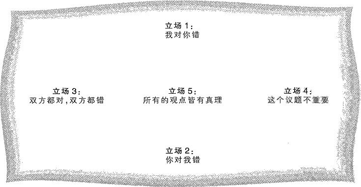

# 第一章 人际沟通人门

证明沟通重要性的证据，早已存在了几个世纪。弗雷德里克二世（Fredrick Ⅱ），公元1196到1250年的德国皇帝，可能是第一个以系统化方法证实这个论点的人。一位中世纪的历史学家描述了他独特的、也许带点残忍的实验：

他命令保姆和护士喂养婴孩，帮他们洗澡，但是不准跟他们说话，因为他想要知道，在没有人跟婴儿接触前，婴儿开口会先说出哪一种语言。是最古老的希伯来语，还是希腊语或者拉丁语？又或者是他们生父母的语言？最后，他徒劳无功，因为所有的婴儿都死了。缺乏养育者的拥抱、慈爱的脸孔、深情的言语，他们根本无法存活。

2022/12/12 22:57

--------------------

那些因为自己选择或不得已成为独居者的事例不断地证实着一点：人类具有想要与人相处的需求。W·卡尔·杰克逊（W．Carl Jackson），一位独自航行55天、横越大西洋的探险家，概述了大部分独居者的普遍心情：

我发现在第二个月出现的寂寞感使我感到很痛苦。我一直以为自己是个自给自足的人，但是此刻我终于明了，没有旁人做伴的生活是没有意义的。我开始有了强烈的想要跟别人——一个真实的、鲜活的、有气息的人类说话的需求。
2022/12/12 22:57

--------------------

## 1．4 人际沟通的本质

即使是面对面沟通很方便的情况下，还是有些人觉得通过CMC分享自己的感觉比面对面沟通容易。社会语言学家黛柏拉·泰南（Deborah Tannen）便描述了电子邮件是如何改善两段人际关系的：

电子邮件加深了我与拉尔夫的友谊。虽然他的办公室就在我的隔壁，但因为他很害羞，我们很少拓展话题。他说话咬字不很清楚，所以在面对面沟通时，我只能勉强地猜测他的意思。但是当我们开始互通电子邮件后，我便常常收到他传来的很长的自我坦露信息。我们彼此倾吐心声。我的一个朋友也发现，电子邮件开启了他和父亲的沟通渠道。他从未和父亲讲过很长的电话（只跟母亲讲过），但自从他们都开始上网后，他们变得比以前亲密多了。

类似这样的经验帮我们理解，为何苹果电脑的创办人之一史蒂夫·乔布斯（Steve Jobs）会主张将个人电脑命名为“人际电脑”。
2022/12/12 23:02

--------------------

## 1．5 如何成为沟通高手？

虽然我们不可能详细地教导你在不同的场合应该如何表现及反应，但是当你无法决定要做什么反应时，也许你可以试着思考下面这三个要素：
2022/12/12 23:03

--------------------

首先是沟通的脉络、时间及地点时常常强烈地影响我们的表现，如果在对的时间点向老板提出加薪或向情人索吻，你可能会得到很好的结果；但是如果提出的时机不对，这种贸然的请求很可能会导致事与愿违。同样地，适合在单身派对中说的笑话如果拿到葬礼中说，下场将会无比尴尬。
2022/12/12 23:04

--------------------

你的目的也会决定你选择的反应。倘若你想要增进与新来的邻居的感情，也许邀请他过来喝杯咖啡或共进晚餐会是个不错的选择，但是假如你仍想保有自己的隐私权，也许见面保持礼貌、不涉及情感会对你比较好。另外，目的也会影响你帮助他人的方式。
2022/12/12 23:04

--------------------

最后，“对他人的了解”也会影响你的决定。如果你和一个非常敏感或局促不安的人相处，你做决定时最好要非常谨慎，并且富有支持性；而如果你是与一个值得信任的老朋友相处，那么你也许可以直率地说出心里的话。沟通社群的社会地位也会影响你沟通的方式，对待80岁的长者与对待青少年的说话方式可不一样。同样地，即使在这个性别平等的时代，我们对待男人与对待女人的沟通方式很多时候也应该不同。
2022/12/12 23:04

--------------------

# 第二章 认同：自我的塑造与展现

## 2．1 沟通和自我概念

在你因为性格因素而造成沟通挫败之前，谨记两件事：第一，我们在这些特质上并不是全有或全无，而是程度的问题。如果认定自己就是“害羞”或“社交的”，“和平”或“敌对”，“自我控制”或“自动自发”，实在是思维过于简单了。比较合适的方式是当了解每一个人的性格时，每个特质都落在某一个程度上。例如，你可能有三分安静、五分忧虑、七分自我控制，诸如此类。
2022/12/12 23:07

--------------------

高自尊的人

1．容易去赞赏别人

2．认为自己会被别人接受

3．比起低自尊者，对自己的表现持有较为正面的评价

4．被注视时，可以表现得很好；不害怕别人的反应

5．愿意为持有高标准要求的人努力工作

6．与他们觉得优秀的人相处，感觉舒服自在

7．可以为自己挺身而出，去对抗别人的负向评论

低自尊的人

1．容易去否定别人

2．认为自己会被别人拒绝

3．比高自尊者，对自己的表现，持有较负面的评价

4．当被注视时，会表现得不好；对其他人负向的反应很敏感

5．愿意为低标准、少批评的人努力工作

6．与他们觉得优秀的人相处，觉得有威胁感

7．难以对抗其他人的负向评论，容易被影响
2022/12/12 23:10

--------------------

在集体主义的社会里往往存在着一种高度的沟通焦虑。举例来说，一个团体中来自东方集体主义文化国家——比如中国、韩国、日本——的成员往往比起个人主义文化——比如美国或澳大利亚——的成员对公开发言表现出明显较高程度的焦虑。
2022/12/12 23:14

--------------------

个人主义和集体主义的差异，在每天的互动中都会显示出来。沟通理论学者史特拉·汀-托米（Stella Ting-Toomey）已经发展出一套理论，揭示了一些重要的规范习俗——譬如正直或直率——所显示的文化差异。他认为在个人主义的西方文化中，有一个很强烈的“我”的定位。西方文化规范中允许人直接发表意见，但是在集体主义文化中，就需要去建立个人和其他人的联结，维持间接接近的和谐状态。“我要做我自己”可能是一个西方人的座右铭，而“如果我伤害你，我也会伤害我自己”与亚洲人的思考方式比较接近的。
2022/12/12 23:17

--------------------

# 第三章 知觉：看到什么就是什么

## 3．3 知觉的倾向

对人严厉，对己仁慈
我们评价自己时往往比评价别人更为宽容，会试图说服自己和别人“我的本意是善良的”。我们倾向用最宽容的条件裁断自己。社会心理学家将这种倾向称为自利的偏误。当别人遭遇不幸时，我们常将问题归咎于对方个人的因素，而自己遭遇不幸时，我们就将问题归咎于外在因素。
2022/12/12 23:22

--------------------

以己之心，度人之腹
低自尊的人会猜想别人以不利于自己的方式看待自己，高自尊的人会猜想别人以对自己有利的方式看待自己，这种以为别人想法类似自己的错误假设广泛且频繁地发生在许多情境中：
2022/12/12 23:25

--------------------

## 3．5 同理心与沟通

同理心 是从某个人的角度来体验世界，重新创造个人观点的能力。也许我们不可能完全体会到另一个人的知觉，但若付出足够的努力，我们的确可以更了解世界对他的意义。当我们在使用同理心这个词的时候，它包含三个面向：第一，同理心包含获得知觉——一种采用另一个人观点的尝试，这需要中止你的论断，将自己的意见放在一边，同时试着去了解对方。第二，是同理心的情感面向，使我们更贴近的去体验别人的感受，去感受他们的恐惧、喜乐、伤心等感觉。同理心的第三个面向是真诚地关心对方的福祉，不光是和对方有一样的想法和感受，而是更进一步，真实地关心他们的福祉。
2022/12/12 23:26

--------------------

我们很容易将同理心与同情心 混为一谈，观念上这两者在两个方向是不同的。第一，同情心表示你用自己的观点来看别人的困境而产生的悲悯之心，而同理心是指你设身处地地思考对方的处境而产生的感同身受。想一下一个未婚妈妈或一个无家可归的人，同情心与同理心之差别何在？想象一下站在她（他）的立场会是什么样子？当你同情他们时，他们的困惑、喜乐和痛苦还只是他们自己的经验；但当你同理他们时，这些经验就好像变成你的经验（至少在此时此刻）。第二，只有在我们明确知道别人痛苦的原因后，我们才会产生同情，但没有同情也可能同理，不必太多同情你仍然可以同理。例如，同理遭遇困难的亲戚、鲁莽的陌生人甚至罪犯。同理心让你了解别人的动机，而不需要赞同对方。同理之后，你几乎可以确定；你更加了解他们，但不见得会对他们产生同情。
2022/12/12 23:27

--------------------

枕头法 是一群日本的小学生所发展出来的，因为问题正像枕头，有四个边和一个中心，故得其名（见图3-5）。如同“沟通文本”专栏——枕头法实际案例所提的筹划婚礼的例子，从每一个不同的观点看议题，几乎总是能得到有价值的洞察。

2022/12/12 23:28

--------------------

立场一：我对你错 　当我们在看一个议题时，这是我们通常会采用的观点。我们立即从我们的立场，看到我们的对以及别人的错，而对方恰好和我们的立场相反，这一个立场毋庸赘述。
2022/12/12 23:28

--------------------

立场二：你对我错 　这是你转换视角，尝试用最强而有力的相反论点，来解释对方如何以不同的观点看此议题。除了认出对方立场的长处外，这也是唱反调的人挑毛病的方法之一。
2022/12/12 23:31

--------------------

立场三：双方都对，双方都错 　从这个立场，你承认了彼此的长处和弱点。如果你在立场二里表现得不错，很清楚的，双方都有优点也有缺点，用更公平的方式看待此事能让你比较不会吹毛求疵，也比较能了解对方的观点。
2022/12/12 23:32

--------------------

立场四：这个议题不重要 　这个观点将帮助你了解到，这个议题并非如同你想象的重要。虽然起初很难将某些议题看做无关痛痒，但是大部分的事情思考一下后，就会发现它不像我们所原先认为的那么重要了。当你了解你不会让这个议题盖过两人关系中其他重要的部分时，这个议题的重要性也会淡化。我们很容易为了争辩一个议题而越陷越深，以致忘了在其他方面两人的观念是非常接近的。
2022/12/12 23:32

--------------------

结论：所有观点皆有道理
在了解了这四个立场后，最后一步就是认识到每一个立场都有些优点，虽然逻辑上不能存在一个既对又错、既重要又不重要的立场。你自己的经验将显示：你探索过的立场都有些真理，而第五个立场与大部分人带进议题的“我对你错”的观念非常不同。在你从五个立场看过这个议题后，你也许已经发现了新的思考模式，这些思考方式也许未必能够改变你的想法，甚至不能解决手边的问题，但它们可以增加你别人立场的容忍度，并因此改善沟通的气氛。

2022/12/12 23:32

--------------------

沟通文本
枕头法实例：筹划一场婚礼

背景

谁会想到筹划一场婚礼会是一场梦魇？我的未婚夫和我挣扎于是把婚礼办成一场盛大的宴会还是小型而温馨的聚会。我喜欢盛大豪华的派对，他却要一个较小规模、负担得起的婚宴。

立场一：我对你错

我有一个大家庭，如果没有邀请每个人，我会有愧疚感。同时，我有很多朋友，如果他们在我特别的日子里缺席，我会觉得很遗憾。如果要发出邀请，我们必须邀请所有人才不至于伤害别人的心，否则邀请的标准在哪？只要能用钱解决的都是小事，我认为一生只结一次婚，并且我也没有时间去细算。我的父母很愿意分担一些费用，因为他们希望我的整个家族都能出席婚礼。
2022/12/12 23:33

--------------------

立场二：你对我错

我的未婚夫是对的，他说我们真的没有钱去支付一场特别又昂贵的婚礼。多挥霍一分钱在婚礼上，我们就少一分钱买房子，而买房子正是我们希望很快能实现的事。我的未婚夫是对的他说一场盛大的婚礼会让我的房子的事延后一到两年，而如果房价开始上涨我们甚至要等更久。他说得对，不管我们邀请多少人，总会有人被遗漏，这只是取决于标准的问题。他说得没错，一场盛大婚礼的筹划过程会带来很大压力。
2022/12/12 23:34

--------------------

立场三：双方都对，双方都错

我们两人都对，我们两人都有错。我想邀请整个家族和朋友到这欢乐的婚礼现场是对的，我认为特别的婚礼将是一辈子的回忆也是对的。他说得也对，他说这么做会留下不好的感觉，他说这么做会延后我们买房子的计划。他的一些观点很不错，计划一场盛大的庆典的确会把我们搞疯，并本末倒置了生活中重要的事情。
2022/12/12 23:34

--------------------

立场四：这个议题不重要

在想过这一切以后，我已经了解t准备被礼和婚姻生活是两码事儿。婚礼的形式很重要，但它毕竟并不能影响我们婚姻生活的形式，婚后我俩如何生活才重要。将来我们要一同面对许多决定，例如孩子和工作——这些事情的结果比婚礼重要得多。
2022/12/12 23:34

--------------------

结论

在使用枕头法思考过这个议题的所有面向之前，我专注于我的方式，那样的态度使我们两人之间产生一些在此关头不该有的负面感觉。我知道如果其中一方赢了，结果仍旧会伤了感情，这并不算是胜利。我不知道我们最后会决定什么形式的婚礼，但我已经决定将我的焦点放在真正重要的目标上，就是维持互敬互爱的正向关系。
2022/12/12 23:35

--------------------

# 第四章 情绪：适时适地传达感觉

## 4．1 什么是情绪？

通之处。耶鲁大学心理学家罗伯特·斯滕伯格（Robert Sternberg）要人们描述一个“有智慧的人”时，得到的答案之一即是：具备了解他人和与他人相处的能力。心理学家丹尼尔·戈尔曼（Daniel Goleman）认为“情绪智商”是我们与别人相处能力的一个面向。戈尔曼主张智商能力并不只是对一个人智力天分的估量，在社会上功成名就的人，大部分是靠着了解和管理自己的情绪，以及体察他人感觉而成功的。

2022/12/13 14:35

--------------------

心理学家菲利普·津巴多为这个法则提供了一个很好的例子：

我注意到当我在演讲时我会冒汗，因此我推论我是焦虑的。假如它时常发生，我甚至可能会自己贴标签为一个“焦虑的人”。一旦我有了这个标签，下一个我必须回答地问题是“为什么我是焦虑的？”然后，我开始去找寻一个适当的解释。我也许会注意到有一些学生起身离开或者心不在焉，我会为这是否因为我的演讲不够精彩而焦虑，而这的确令我焦虑。我如何知道这场演讲不精彩呢？因为我让我的听众觉得索然无味，我会焦虑是因为虽然我想成为一个演讲高手，但实际上我是一个乏味的演说者。我觉得我不适合演讲，我干脆去速食店工作还快活一点。不久之后有学生跟我说：这里太热了，我一直在流汗而无法专心听你的演讲。剎那间，我不再是“焦虑的”或“令人乏味的”了。
2022/12/13 14:46

--------------------

## 4．3 情绪表达的原则

高度情绪沟通者与低度情绪沟通者的比较：

1．更快乐

2．更自我肯定

3．对人际亲密比较自在

4．比较不会沮丧

5．较没压力

6．心理健康较佳

7．较常从事规律的社交活动

8．较少感觉到社交孤立

9．较常接受到别人的情感

10．较常处子满意的恋爱关系中
2022/12/13 14:57

--------------------

评估何时与何处表达感觉
通常，一阵强烈情绪涌上的瞬间并不是说出口的最佳时机。假如你被隔壁吵人的邻居所干扰，一时的过度怒骂、抱怨可能会导致日后你对自己所说过的话感到后悔。说话前先深思熟虑过要如何用最可能被接受的方式表达你的感觉，才是较为明智的。学者提出“想象的沟通”使得沟通者能够预先演练；他要怎么说及对方可能会怎样冋应，以便在实际沟通能够增进关系。
即使是你已经等待涌上心头的强烈情绪退去，还有一件重要的事情是，选择最适宜表达这个信息的时机。你正被某些别的事情所逼迫，心烦或困扰，可能是你延缓表达情绪的一个好理由。处理你的情绪往往会花很多的时间和心力，疲惫和分心会使得你想要表达情绪这件事更难处理。同时，你应该用相同的态度，确认你的信息接受者在你要开始之前，已经准备好要听完你说的话。

在某些情况下，你也可能选择永远不要表达情绪。当老师问你“你觉得我的课如何”时，即使你非常想跟你的老师说他的课非常无聊、让你昏昏欲睡，最好的回答仍然可能是无关痛痒的“还好啦！”即使你被一个抓你超速的傲慢警察所激怒，最明智之道还是忍耐着不流露出愤怒。如果你感觉到强烈的情绪经验但是又不便口头表述出来（有难言之隐），写出你的感受与想法，确实是有利于心理、生理和情绪调适。
2022/12/13 15:01

--------------------

对自己的感觉负责
你的表达方式反映了你对你自己的感觉负责，这个事实很重要。避免说“你让我生气”而是改说“我在生气”，避免说“你伤害我的感觉”而是改说“当你那样做时，我觉得很受伤”。你会很快察觉到，并不是别人让我们喜欢或讨厌他们，所以，一味认定是别人造成我们喜欢或不喜欢他们，就是否认我们每个人都要为自己的情绪负责。
2022/12/13 15:01

--------------------

## 4．4 管理困扰的情绪

首先，我们需要区分有助益与无助益的情绪之间的不同。有助益的情绪 有助于效率，无助益的情绪 降低有效运作情况。

这两种类型间的差异是它们的强度。例如，某种程度的生气或恼怒可以是具有建设性的，因为它往往会提供让你改进不满意状态的刺激；但另一方面，盛怒通常会让事情更糟糕。会引起焦虑的情境，比如在一个重要的运动竞赛或工作面试之前的紧张，可能会提升表现的动力，但若是陷入极端恐惧就又另当别论了。少许猜疑有时可以使人成为更有效的沟通者，一个研究显示，会去怀疑他们的伙伴是否真心相待的人比较能察觉欺骗的迹象，而那些始终一直信任对方的人对欺骗比较迟钝。当然，一个极端疑心病的偏执狂可能会产生相反和无益的效果，反而降低正确地理解同伴行为的能力。
2022/12/13 15:04

--------------------

第二个区别无助益情绪和有助益情绪的地方是它们时间的持续性 。在一段人际关系瓦解或丢了一份工作之后，自然会有一段时间陷入沮丧，但是，对于你所失去的过度悲伤而花费你生活中的过多时间将会使你一事无成。同样的，持续地对于某个犯错的人生气无疑是像在惩罚犯错的人一样惩罚你自己。
2022/12/13 15:05

--------------------

无助益情绪的来源
对大多数的人而言，感觉似乎是自成一格。你希望当你接近陌生人时能够泰然自若，可是你的声音仍然颤抖不停；当你要求加薪时，你试着展现自信，但是你的眼睛却焦虑地眨个不停。这种情绪是怎么发生的？

生理因素 　有一个答案就是基因造成的，就向你在第二章读到的，性格、气质很大比率是遗传所致，许多沟通特质像害羞、口语攻击和肯定都跟生理因素密切相关。幸运的是生理因素并非命定，你接下来会读到，无助益情绪是可以克服的。

除了遗传，认知科学家告诉我们某些无助益情绪的肇因——尤其是在涉及“迎战”或“投降”反应等方面——与大脑息息相关，像核桃般大小的杏仁核负责相互联结结构，杏仁核像哨兵一般扫描每一个传送进来的经验并监视威胁信息，它忠实地在短时间内发出警报，引发一连串的生理反应：心跳增加、增高血压、感官敏锐、肌肉反应灵敏等。

这种防卫系统在我们面临真实的生理危险时非常有价值，但是在没有具体威胁的社会情境中，杏仁核也会迫使大脑诱发出害怕或愤怒的情绪。当有人站得靠你太近你可能会觉得不自在，或是有人插队会让你生气，深思一下，如何避免对这种不具威胁性的情境过度反应。

情绪记忆 　有些威胁的来源是来自神经科学家说的情绪记忆，我们经常看见只要这个事件与过去困扰经验有一点点相似之处，即使是寻常事件也会引发无助益情绪，以下例子可以说明这个观点：

▶ 约翰自从在小学转学被嘲笑之后，只要在不熟悉的情境都感到不自在。

▶ 玛丽安觉得很了解带着深沉磁性声音的男人，因为当她还是个孩子时，她被带有这种男低音的家人虐待。

▶ 罗伯特只要遇到使用某种香水的女人就觉得不安，因为他之前被使用这种香水的女人甩了。
2022/12/13 15:07

--------------------

艾尔本·埃里斯（Alben Ellis），发展了理性情绪治疗法这个认知取向的人，引用一个故事使这个论点更清晰。想象你自己经过一个朋友家，看到你的朋友把头探出窗口，并对你骂了一连串难听的绰号（你自行想象一个朋友和绰号），在这个情境之下，你可能感到受伤和心烦。现在，换成想象你正经过一间精神疗养院，相同的是这位朋友在那里，显然他是一个病人，对你大骂同样难听的绰号。在这个情况下，你的感觉可能会相当不同，很有可能转变成悲伤和怜悯。在这个被叫绰号的故事情节中，你可以看到，面对同样的情况，情绪的结果却非常不同。你有不同感觉的理由，来自你在每一个情况中的想法。在第一个情况中，你的想法可能是：你的朋友对你很生气；或者，你可能猜测你一定做了什么严重的事，而受到如此的对待。在第二个情况中，你的想法可能是：你的朋友有某些精神问题，很可能你会感到同情。
2022/12/13 15:08

--------------------

完美的谬误 　接受完美谬误 的人，相信一个很好的沟通者应该有全然的信心和技巧来处理每一种状况。

在你接受“很好的沟通者是令人满意和无所不能的”这个信念之后，下一个步骤是假定你不完美，人家就不会欣赏你。从这个态度看来，承认你的错误或说“我不知道”和流露不确定的感觉，似乎像是社交的缺陷。对于得到别人的重视与欣赏，寄予厚望和深切的渴求的人，会尽量努力试着表现完美，但是，这种欺骗的代价是很高的，假如别人最后发现你的隐瞒真实的欺瞒行为，他们会视你为骗子。即使你的行为没有被揭发，这样的行为也会使你耗尽心力，因此，得到的快乐是很少的。

2022/12/13 15:11

--------------------

赞同的谬误 　持有赞同的谬误 的人，认为得到别人的赞同是生活上不可或缺的事，并且十分向往得到所有人的赞同。接受这种想法的人会耗费令人难以置信的时间从他人身上寻求赞同，甚至牺牲他们自己的原则和幸福也在所不惜。接受这种谬误会导致某些荒唐可笑的情形：

2022/12/13 15:10

--------------------

应该的谬误 　应该的谬误 是不能区分“是什么” 和“应该是什么” 。想象一个对这个世界满腹牢骚的人，你就可以看到其中的差异：

“周末应该不会下雨的。”

“人类应该长生不老。”“钱应该长在树上。”

“我们应该会飞。”

显然地，类似这些抱怨是愚蠢的，而这些可能都是会讨人喜欢的愿望。
2022/12/13 15:11

--------------------

心理学家阿隆·贝克（Aaron Beck）指出一些不切实际的自我欺骗的“应该”：

“对于每一个问题，我应该能够找到一个聪敏的解答。”

“我应该不会感到受伤；我应该总是快乐和安适的。”

“我应该一直展现极度的宽宏大量、体贴、高贵、勇敢和不自私。”

像这样变得迷恋于“应该”，会有三个恼人的后果。第一，它导致不必要的痛苦，因为不断渴望理想的人，很少满足于他们现在已经拥有的或欣赏他们现在的样子。第二，只是抱怨没有行动，会让你不想做任何事来改变不满意的状态。第三，所谓的抱怨会使得痛恨喋喋不休的人建构一种防卫的氛围。告诉人家你喜欢什么，会比说教更有效用。尝试一下把“你应该准时”变成“我希望你能更守时”吧。我们将在第十章讨论避免防卫性氛围的方法?
2022/12/13 15:12

--------------------

过度推论的谬误 　过度推论的谬误 包含两种类型。第一种出现在当我们以有限的证据为信念时。举例来说，多少次你发现你自己说了类似下列的话：

“我真笨！我总是不了解如何算出我的所得税。”

“我算什么朋友！我居然忘记我最好的朋友的生日。”

上述情况里，我们只聚焦于有限的不足之处，似乎它代表我们的全部，而忘记加上我们解决棘手地问题时所遭遇到的困难。而且，尽管我们有时候是疏忽的，但是，在其他时候我们是用心和细心的。

第二个过度推论的类型发生在我们夸大缺点的时候：

“你从来不听我说。”

“你总是迟到。”

“我无法思考任何事。”

试着进一步检核，这些“绝对的”陈述几乎都与事实不符，而且往往导致灰心或生气。当你用更准确的信息替代过度推论来描述你自己或他人时，你将会觉得好得多：

“你常常不听我说。”

“这星期你已经迟到三次了。”

“今天我没有想出任何我中意的点子。”

许多过度推论是基于是的滥用。例如，“他是一个白痴（一直？r和“我是一个失败者（对于每件事？）”将会使你看到你自己和他人处于一个不切实际的负向状况，因此而造成无助益的情绪。
2022/12/13 15:16

--------------------

因果论的谬误 　因果论的谬误奠 基于认定情绪是由他人引起，而不是一个人自我内言的非理性信念。

这个谬误引起的烦恼有两个状况。首先是对于那些沟通过度谨慎的人造成困扰，因为他们不想“引起”别人的任何痛苦或麻烦。这个态度发生在类似这样的情况：

“探望朋友或家人出自于义务，而不是一份真诚的渴望要看他们。”

“当别人的行为打扰到你时，你仍然保持沉默。”

“当你已经快要迟到下一个约会，或觉得身体不舒服时，还是假装专心听演讲者说话。”

“让询问你意见的人放心并称赞之，即使你真正的答复是否定的。”
2022/12/13 15:17

--------------------

无助的谬误 　无助的谬误 是生活的满意度遭受到超过你能控制的压力所决定。不断地视自己为受害者的人会有这样的陈述：

“在这个社会女人绝对无法有出息，它是男人的世界，我所能做的事就是接受它。”

“我生性害羞，我想变得比较外向，但是没有办法。”

“我不能告诉我的上司他对我要求太严，如果说了，我可能会丟工作。”
2022/12/13 15:18

--------------------

灾难性预期的谬误 　抱着灾难性预期的谬误 之人会杞人忧天，他们认定假如某件糟糕的事可能会发生，那么它就一定会发生。典型的灾难性预期包括：

“假如我邀请他们参加宴会，他们或许不会想来。”

“假如我为了解决一个冲突而公开表示意见，事情可能会弄得更糟。”

“假如我去应征一个我想要的工作，大概不会被录取。”

“假如我告诉他们我真实的感受如何，他们也许会嘲笑我。”

一旦你开始期待灾难性的后果，自我应验预言就会开始建立。研究显示，认为他们的伴侣不会为了使彼此关系更好而有所改变的人，很可能会做出造成这层关系决裂的举动。
2022/12/13 15:19

--------------------

沟通文本
行动的理性思考：应付令人讨厌的顾客

以下的范例是说明前文所描述的理性思考方式如何应用于每天的挑战之中。要注意理性的思考不能消除无助益情绪，而是有助于它们受到控制，更有可能进行有效的沟通。

引发的事件

我在一个挤满观光客和当地居民的大塑购物中心工作，我们公司的信誉基于服务。但是，不久前我已经对我的顾客失去耐性。这间店从开始营业到营业时间结束都很忙，许多顾客是无理、坚持己见和苛求的，其他人期待我成为一个导览者、餐馆评论者、医疗顾问甚至是小孩的临时保姆，我觉得我好像随时要爆炸了。

信念和自我内言

1．我已经厌烦与群众有关的工作，人真的令人讨厌。

2．顾客应该是更有耐心和礼貌的，而非像对待仆人般地对待我。

3．这个工作逼得我快发狂！如果我继续待在这里工作，我将会变得和顾客一样无理。

4．我不能辞职：我应该找不到另一个待遇相当的工作。

驳斥非理性信念

1．它过度推论地说所有的人都是令人讨厌的。实际上，大多数的顾客是好的，有的甚至是很好，约有10%的顾客会制造大部分的纷争。辨识到大部分的人是好的，让我不觉得那么痛苦。

2．惹人讨厌的顾客应该更有礼貌是事实，但是期待每一个人必须这样做是不切实际的。毕竟，这不是一个完美的世界。

3．就顾客逼得我快发狂来说，我想是我没有控制好这个场面。我是一个成人，而且我可以控制住我自己，我可能不喜欢某些人的行事作风，但如何回应他们是我的选择。
2022/12/13 15:22

--------------------

记录你的自我内言：分析联结在事件发展和你的感觉之间的思考时，这是一个重点。假如你是认真要除去无助益的情绪，在第一次学习使用这个方法时真实地写下你的自我内言是很重要的。把你的思考写在纸上，将有助于你了解自己看看它们是否真的产生任何感觉。

监控你的自我内言刚开始可能是困难的，这是一个新的行动，而任何新的行动看来好像会是难运用的，无论如何，假如你持之以恒，你将会发现你能够确认导致你的无助益情绪的想法。在你养成辨认内在独白的习惯之后，你将能够又快又容易地辨识你的思考。

驳斥你的非理性信念：驳斥你的非理性信念是在理情治疗法里的成功之钥。运用在前文所条列出来的非理性谬误，找出你基于错误思考的内在陈述。

你可以借由以下三个步骤而最有效率地完成它。首先，判定你所记录的每一个信念是理性的或是非理的。接着，解释这个信念为什么是理性的或是非理性的。最后，假如这个信念是非理性的，你应该写下一个较为理性的替代思考，那可以让你在未来面对相同的事件发展时，感觉会更好。

用更具建设性的思考取代自我打击的自我内言，提供了一个特别有效的工具以增进自信和关系的交流。
2022/12/13 15:26

--------------------

# 第五章 语言：既是障碍又是桥梁

## 5．2 语言的影响

不同名字有不同的内涵。在一项研究中，心理学家们要求大学生根据一千多个名字的可爱程度、看起来是主动或被动、阳性或阴性等来为这些名字评级。虽然有众多的名词，但回答却相当接近。迈克尔、约翰、温迪是受欢迎及主动的名字，且被评为在性别中拥有阳刚特质或阴柔特质；帕西法尔、伊萨多、阿尔弗雷德则较不受欢迎，且不容易看出其性别。其他研究指°出名字拥有强烈的隐含意思。许多常用的名字通常被视为主动性、较强烈及优于较不常用的名字。名字的影响确实影响人们的第一印象，但在沟通者相互熟识后似乎影响力就降低了。
2022/12/13 15:31

--------------------

这样把事实性的陈述和意见性的陈述摆在一起时，差别便显而易见。在每天的对话中，我们通常把我们的意见当作事实一样陈述，也因此我们引发了不必要的争论。例如：

“笨蛋才会这么说！”

“花这么多的钱在一双鞋上，实在是太浪费了！”

“在这个国家，除非你是白人，要不然不会有公平的待遇。”

留意一下，如果这些陈述前面加上“在我看来”或“我觉得”等修饰语，则陈述可以显得不那么具敌对性。本章后面会讨论“我”信息的重要性。

2022/12/13 15:33

--------------------

当我们把我们的推论当作事实时，争议便由此而生。

A：你为什么要对我生气？

B：我不是在气你。为什么你最近那么没有安全感？

A：我才不是没有安全感，是你有些吹毛求疵。

B：“吹毛求疵”，你这话是什么意思？我才没有吹毛求疵……

尽量不要去猜测他人的心思。我们可以用你在第三章所读过的察对知觉的技能，来辨识我们所观察到的行为（事实），并尽可能地做描述。在描述这一长串的想法后，问一下他人对你所描述的正确度做评论。

“当你不回我电话时（事实 ），我便会升起你在对我生气的念头（推论 ）。真的是这样吗？”

“你最近一直问我，我是不是还爱着你（事实 ），这让我猜想你很没有安全感（推论 ）。或许我最近的行为有些反常。你在想什么？（疑问 ）”

2022/12/13 15:34

--------------------

避免因情绪性字眼而产生争议的最佳方法，是用中性字眼来描述人、事物或想法，以及用之表示出你的观点。不说“我希望你戒掉这些性别歧视的评论”，而说：“我不喜欢你用‘女孩’这个性别标签来称呼我们。”这种不带情绪性的陈述不但显得精确，被别人接受的可能性也更大。
2022/12/13 15:35

--------------------

“你迟到的这件事，对我很困扰。”

“你迟到让我很担心。”

“看到你真是一件高兴的事。”

“我很高兴看到你。”

“这堂课很无聊。”

“我无精打釆地在上课。”

正如其名，“这件事”的陈述 用较不直接的字“这”来取代“我”这个人称代名词。相反的，使用“我”的语言 清楚地辨识出，说话者是这个消息的来源。使用“这”陈述的沟通者会逃避对信息所有权的责任，而用一些无法辨识的来源取代之。这样的习惯不只是不精确，更重要的是这是一个无意识地想逃避立场的方式。你可以开始鉴别一下，在你的对话中增加具有直接性的“我”的语言，替代较不直接且有托词意味的“这”的陈述的效果。
2022/12/13 15:37

--------------------

“这篇报告有许多不错的观点，但是因为你迟交，所以我只能给D的成绩。”

这些使用“但是”的陈述就好像“心理学的三明治”一样，把真实却又残酷的信息夹在令人较为愉快的观点里。这种方式也是一种保留颜面的策略，必要时可以使用。无论如何，当目标必须绝对清楚时，最好的承担责任的方式是一语道破，而不是用“但是”的陈述来分散注意力。
2022/12/13 15:38

--------------------

“你爱我吗？”安全地取代了“我爱你”这句可能会很尴尬、极具亲密或威胁性的话。

有时表现得不那么直接是一种面对一个不容易应付的话题的机智方式。尽管在不是那么必要时使用，间接是一种避免替自己说话的方式。

2022/12/13 15:38

--------------------

使用“我”和“你”的语言 　我们已经了解使用“我”这个字的陈述，是一种为信息负责的方式。使用“你”字的陈述相当的不同：它表达出对他人下论断。注意下列每一项“你”陈述，都隐含着对对方的抱怨：

“你把这个地方弄得一团乱！”

“你没有遵守你的承诺！”

“你有时候真的很残忍！”

有时候使用“你”字的陈述不一定要包含“你”这个人称代名词，不过也能隐含着相当坦白的陈述。

“这是一个很愚蠢的笑话！”（“你的笑话很愚蠢。”）

“不要这么爱挑毛病！”（“你太吹毛求疵。”）

“把自己管好就好了！”（“你太好管闲事了。”）
2022/12/13 15:41

多用【我】，少用【你】。

--------------------

虽然含有“我”字信息的语言有它的优点，但即使把“我”信息传达、表达到最完整、最彻底也不是都无往不利，就像“我”信息的提倡者作家托马斯·戈登（Thomas Gordon）说的：“不管你用什么方式来陈述，都没有人会喜欢听到自己的行为会造成别人的困扰。”此外，“我”信息从大方向来看可能会有点自我中心，研究显示自私与自我中心的人、尤其是有“沟通自恋”倾向的人，经常都只用第一人称单数的“我”做沟通。因为这些理由，在运用“我”信息的语言时，最好是有节制地使用。
2022/12/13 15:42

--------------------

不难看到，“我们”的语言是如何形成有建设性的气氛的。除了让人感到亲近外，还有种“我们同在一起”的倾向，反映出沟通中人际关系的本质。使用第一人称复数形代名词，可以表示出和别人的密切程度、共通性及凝聚性。举例来说，使用“我们”语言的夫妻对婚姻的满意程度会比经常使用“我”和“你”的语言的夫妻来得高。

另一方面，“我们”的陈述也不一定都是恰当的。有时；候，使用这样的称呼会很冒昧，因为听起来好像你们是对等的。不难想象，当你说“我们有问题了……”时，另一个人可能会说“也许是你有问题，但不要跟我说是我的问题！”

2022/12/13 15:43

--------------------

如果你所使用的“我”字的语言没有反应出过度的自私，使用“你”字的语言展现出对他人的关怀而非评论，使用“我们”的语言来包括他人却又不代表他们的话，你可能接近了使用人称代名词最理想的境界。
2022/12/13 15:43

--------------------

## 5．3 性别与语言

女性在对话的表现上比男性更加变化多端。举例来说，根据一项研究指出，女性在男女混杂的对话中的问题比男性多，而且是近乎三倍。其他的研究也指出在男女混杂的对话中，男性打断女性说话的次数胜过其他的谈话方式。男人也比女人更常用评断式的形容词（“读书是一件烦人的事”），更多的直接指导（“再多想一下”），更多跟自己有关的陈述（“我有很多事情要忙”）。女人比较常强调副词（“他真得很有趣”），情绪的陈述（“如果他是真的关心你……”），不确定动词（“这对我来说好像是……”），语带矛盾（“有点冷，不过，还好啦！”）这些差异显现出男人说话典型地倾向于直接、简洁和任务取向，相反的，女性说话比较典型的方式是间接的、详述的和关系取向的。
2022/12/13 17:09

--------------------

因为女人都通过对话来追求社会需求，女人经常使用陈述来向他人表现支持、显示同等地位及让对话持续的努力。因为有这些目标在，传统上被认为属于女性的对话通常都会含有同情及同理的陈述——“我觉得那根本就是我”、“我也有相同的遭遇”——也就是很正常的事情了。女人也倾向会去问问题来请他人分享资讯你觉得怎么样？”“你下一步会怎么做？”女性看重经营关系，这也解释了为什么女性的谈话通常有点缺乏效率和犹豫不决。“这只是我的想法……”和较为明确的“我的观点是……”相较之下，前者显得较不可能去妨碍另一名对话中的伙伴。
2022/12/13 17:10

--------------------

# 第六章 非口语沟通：超越字词之外的信息

## 6．3 非口语沟通的类型

研究者在实验中曾让一些男人跟女人看各种不同的图片，再测量他们瞳孔放大的程度，这实验的结果是很有趣的：男人在看到全裸女人的照片时瞳孔会放大18%，而女人在看到全裸男人的照片时瞳孔会放大20%。非常有趣的是，当女人看到妈妈和婴儿的照片时，瞳孔放大的程度最大。
2022/12/13 17:21

--------------------

人类学家爱德华·霍尔定义出我们在日常生活中的四种距离，依据我们在特定时间点下对这个人的感觉、对话内容以及我们的人际关系目标来决定。

▶ 霍尔的四个空间范围中的第一个是最小的亲密距离 ，这样的距离从皮肤接触到半米左右。通常只有非常亲密的人可以处于这个空间之内，并且多半会发生一些私人情境中——做爱、拥抱、安慰、保护。

▶ 第二个空间的范围是个人距离 ，这个距离介于半米到1.2米之间，这样的距离通常是夫妇在公开场合站在一起的距离。不过，如果在宴会中有异性站在这样的距离，你可能会觉得有些不舒服。这样的移动通常也代表着要开始一个随性的谈话。在这样的距离下我们可以与某个人保持“一个臂膀的长度”，暗示着在这范围之内有沟通正在发生。

▶ 第三个空间是社会距离 ，这个距离介于1.2到3.6米之间。在此距离下发生的沟通大多是商业行为。在此距离内比较近的一档是1.2到2米，这样的距离通常是销售员与顾客或是同事之间的距离；而比较远的一档——2到3.6米——在合乎礼节及非个人的情境里，这样的距离通常是我们跟老板之间的距离，这样他可以穿过他的办公桌看到我们，这跟拿一张椅子坐在老板旁约1米的距离有很大的不同，让人不那么紧张。

▶ 公共距离 在霍尔的分类中是最远的一种，指的是3.6米以外的距离。在这公共距离里，比较近的距离就是大多数老师在教室里的距离，较远的空间——超过7.6米以上的距离——对于两个人的沟通来说几近不可能。演讲者大多数采用公共距离，其原因是听众的人数太多了，但我们同时也可以猜想，如果有人在可以选择的情况下仍然选择公共距离，那就表示他不想有任何的对话。
2022/12/13 17:23

--------------------

# 第七章 倾听：不只是听见

## 7．3 倾听的挑战

少说话 　季诺（Zeno，斯多葛学派之祖）的语录中说：“我们一生下来就有两个耳朵，但却只有一个嘴巴，就是为了要让我们可以多听而少说。”
2022/12/13 17:26

--------------------

## 7．4 倾听反应的类型

说话者 ：我是很想去，可是我怕我负担不起。

鹦鹉式回应 ：你说你很想去，可是你负担不起。

释义式回应 ：所以如果我们能一起想想办法，帮助你负担这笔钱，你就可以和我们一起去了，是这样吗？

说话者 ：天哪！你看起来真是有点糟糕！

鹦鹉式回应 ：你觉得我看起来很糟糕！

释义式回应 ：你是不是觉得我看起来胖太多了？

2022/12/13 17:28

--------------------

1．改变说话者的措词：

说话者 ：双语教育真是一个失败又浪费钱的政策。

释义者 ：你看看我说的对不对，你很生气是因为你觉得双语教育表面听起来很棒，但是实质上却没什么作用，对吗？

2．从你所接收到的对方信息当中，抓出一个具体例子，来向说话者说明你所了解的程度：

说话者 ：李真是一个浑蛋，我真不敢相信他昨天晚上所做的事！

释义者 ：你觉得那些笑话很惹人讨厌，对吗？

3．反映说话者的潜在寓意。在言谈中，如果你觉得对方似乎有一些暗喻在言语中忽隐忽现，在你就他的话展开回答前，做一个整体或部分的理解性核对是必要的。

释义者 ：你一直提醒我要小心，听起来你好像是在担心有一些事即将发生在我身上，是吗？
2022/12/13 17:30

--------------------

其实要分辨非真诚的支持性回应是很容易的。有些学者说这是“冷安慰”（详阅表7-2）。下面会给出一些缺乏同情心的词语，当你使用它们的时候，你可能就不是真心地在提供支持：

表7-2 冷安慰：无助益的信息

别这么难过，反正她不过是个浪荡女子。
那也没什么啦，你要不要听听我有多倒霉？
总之，我不知道你看上他哪一点！他很烂，你可以找到更好的人的。
你知道接下来会如何？老天爷迟早会还你一个公道的。
他／她对你而言太年轻（老）了。
你不可能在一生中什么都要。
现在总算结束了，我敢说他从头到尾都在欺骗你，那个浑球！
他只是利用你做性工具。
他总是在你背后狠狠地桶你一刀，要这种人干吗？
现在我们更有时间到处闲晃了，就像以前那样。
我很高兴你决定不理他。我曾听过一个故事，一个家伙的女朋友决定跟他分手，他求了又求、求了又求、求了又求，求他女朋友回来，最后她心软了。二十年后，她染上药瘾、自杀多次，还得了心脏病，一无所有地离开他。你不知道你省了多少麻烦。
2022/12/13 17:31

--------------------

否认别人拥有感觉的权力：许多非同理式的回应都是在暗示对方拥有某些感觉是错误的、不应该的，例如在“不用担心”的这句话中，虽然它的目的是为了要让对方消除心中的恐惧，但其实它的潜在意思是希望对方可以换一个感觉不要再自怨自艾。像这样的反建议是没有帮助的，毕竟别人不会因为你这样告诉他们就真的可以停止忧虑。还有其他拒绝别人感觉的例子包括“这又没有什么，不值得你那样难过”、“你这样想真的很荒唐可笑”。对于人们的情绪回应，研究结果的建议是很明确的：一个受挫的人在别人面前只能隐藏真正的想法，或其情绪和观点被对方否认，他将得不到有助于他的回应；如果他所传递的信息中的情绪和观点，被明确、清楚、合法地接纳，这样的回应才会有助于此人。
2022/12/13 17:32

--------------------

看轻事情的重要性：想想看别人曾经告诉过你的这句话，“那不过就只是……而已”，你可以在空格上填上任何词语，例如“一份工作”、“她自己的想法”、“一切考试”、“一次小小的恋爱”、“一个庆生会”，当你听到这些话时你的反应是什么？你可能会觉得那个人根本不了解你的感觉。对一个被言语侮辱的人来说，那些语言对他就不只是一些“字”而已，而是一种深深的伤害。对一个孩子来说，当他没有被朋友邀请去参加庆生会时，那个

庆生会对他来说就不只是“庆生会”。对一个快被老板炒鱿鱼的人来说，那份工作对他来说就不只是“一份工作”。如果你这样地看轻对别人来说很重要的事物，你就不是在使用同理式的回应。相反的，你是从你的观点出发去做评断，对别人一点帮助也没有。
2022/12/13 17:33

--------------------

 聚焦在“彼时彼地”，而非“此时此地”：在遇到困难时，我们会认为睡一觉醒来隔天的心情就会好一点，但是也有的时候却反而更糟。虽然“十年后你也不会记得她的名字”的说法有时也是事实，但是这种安慰的话对现在正值心情低潮的人来说确实没有多大帮助。虽然这些话的目的是希望对方可以多增加一点信心，但是这些聚焦在“彼时彼地”的说法对今天正在心碎的人毫无安慰的效果。
2022/12/13 17:33

--------------------

 火上加油的评断：当你做了错误的决定时，又听到“你知道吗，这都是你的错！当初你根本就不应该这么做的”之类的话，你肯定会真的感到很泄气。这样的回应反映出倾听者的评断态度，你会觉得对方并没有和你站在同一阵线。在第十章中将会继续讨论，一个评价式的、使人屈服的言论，是如何地无法发挥助人效用，却反而带来更多防卫。
2022/12/13 17:34

--------------------

 自我防卫：在回应别人的时候，话中还不忘防卫自己，例如“不要怪我！我已经做了所有我该做的事了”，很显然的，你其实是觉得关心你自己比关心对方还要重要。
2022/12/13 17:34

--------------------

如果能够正确回应，支持性反应应该可以发挥一点功能。有效的支持性回应有几个参考原则，包括：

1．对他人内心的挣扎提供支持，但不表达自己赞同或否定的想法。例如你的朋友决定要辞掉一个你认为应该保留的工作，你可以使用支持性回应：“我知道对于这件事情，你已经思考得很周全了，我想你会为你自己做最好的决定。”这样的回应不但不会违背你自己的想法，也可以表达你对对方的支持。
2．观察对方对你的支持性回应。如果你发现你的回应似乎对他没有太多帮助，你就必须换一个适合对方继续探索问题的回应方式。

3．要了解到支持也不是永远受欢迎。一项调查显示，有些人不需要社会支持，因为他们自己可以解决所发生的问题，也有人认为未预料到的支持其实是一种打扰，有些人甚至觉得这使他们更加陷人焦虑。大多数的被调查者表示不管要不要跟他自己的好朋友讨论这些烦恼的情境，他们都希望能自己掌控。
2022/12/13 17:35

--------------------

对别人提出分析与解释，可以帮助对方思考问题的许多替代的症结，而这些症结可能就是他以前从来没有想过的部分。不管是向对方提供解决问题的方法，或是让对方了解你所知道问题的来龙去脉，清楚的分析可以让混乱的问题突然清晰明朗起来。

不过，也有一些例子提醒我们，分析不但不能解决问题，反而会制造更多问题。分析可能会造成两个问题：第一，你的解释可能不正确，所以接受你建议的那个人反而会感到更困惑，第二，即使你的分析是正确的，如果你直截了当、不加修饰地就这样把你的分析说出来，可能会引起对方的防卫，因为你分析对方，就是在暗示你比对方优越到可以去评价他。就算没有引起防卫，在他真正尝试去做之前，其实也没有办法体会你的观点。

所以，我们最好知道自己的分析在何时可以发挥最大的效用。以下的原则或许可以提供几个遵循的方向：

1．在提出解释时，使用试探性的口气会比绝对性的口吻更好。我想当你说“也许这个问题的原因是……”或“这个问题在我看来可能是……”与你说“这就是事实”是不一样的。

2．你提供的分析应该是要合逻辑性、接近事实的，一个不正确的分析，尤其是模棱两可的分析，反而会让对方感到更困惑。

3．确定对方的准备度足够，适合接受你的分析。因为即使你的分析正确，对方如果还没准备好要接受它的话，仍然会徒劳无功。

4．确认自己提供分析的动机是基于协助，而非借此突显自己聪明或显示对方差劲的，因为在这种动机下所提供的分析将毫无助益。
2022/12/13 17:36

--------------------

# 第八章 发展关系动力

## 8．3 对关系做沟通

有时候，受人尊重比受人喜爱来的更重要。想想你的学校生活，当你的意见或问题不被同学或师长当一回事时，是不是感觉很不舒服？在工作上这个法则也同样存在，自己提出的意见具有商业价值比让人听着开心更有意义。在许多关系中，尊重的议题常是引发争执的焦点，对自尊来说，被认真地对待是极为重要的要件。
2022/12/13 17:39

--------------------

# 第九章 表达亲密感

## 9．1 关系中的亲密

韦伯新大学辞典将亲密定义为“一种‘密切结合、接触、联盟或熟识’的状态”。这种亲密感可以出现在各种不同的关系里。研究者询问数百位大学生什么是他们觉得“最贴近、最深人、最投入、最亲密的关系”，几近于一半（47%）的回答是爱情，大约三分之一（36%）的人认为是友谊，剩下的大多数（14%）选择家庭。
2022/12/13 17:41

--------------------

直到最近许多社会科学研究者才相信，女人比男人更会建立和维持亲密关系。这个观点源自于，表达一些个人的信息是建立亲密关系最重要的要素。许多研究确实显示出女人比男人更容易分享她们的想法和感觉，虽然这之间的不同没有人们所想象的那么戏剧化。就所交换的信息深度而论，女性和女性关系是在自我开放的列表中的最上层，男性和女性关系则位居第二；反之，男人和男人之间的关系牵涉最少的自我开放。在每个年龄阶段，女人都比男人更开放自我，而且分享的信息多半是私人性质且涉及感觉。虽然两性大都会揭露负面的信息，但男性更少分享正向的感觉。
2022/12/13 17:43

--------------------

## 9．2 关系中的自我袒露

有一种检视自我袒露在人际关系中扮演什么样的角色的方法，叫做乔哈里视窗 （命名方式是由创造者乔瑟夫·勒夫〈Joseph Luft〉和哈里·英汉姆〈Harry Ingham〉的名字结合而来）。如图9-3展示出了有关你这个人们全部，包括你的喜好和厌恶、你的目标、你的秘密和你的需求，等等。

当然，你无法了解全部的自己。大部分的人都时不时会发现一些和自己有关的新事情。为了体现这种情况，我们可以把这个包含你全部事情的图分为两个部分，一部分是你所知道的，一部分是你所不知道的，
2022/12/13 17:48

--------------------

第一个部分是你自己知道而他人也知道的，这个部分是你的“开放区”。第二个部分是“盲视区”，你自己所不知道，而他人却知道的部分，这个区域中的信息你只能通过他人的反馈而得知。第三个部分是你的“隐藏区”，是你自己知道但却不愿意表露给他人的信息。这些信息唯有通过自我袒露才会显现出来，这也是本章节的重点。第四个部分是“未知区”，是你不知道，他人也道的这个部分是存在的呢？我们可以通过经常发现自己的一些新的特质，来推论这个区域存在的可能性。这并不困难，你会发现自己一些以前所未觉察到的天赋、才能与弱点。当你开始对自己观察时，这些潜在的特质就会从“未知区”移至“开放区”。
2022/12/13 17:49

--------------------

# 第十章 增进沟通气氛

## 10．2 防卫：原因与对策

接下来，让我们来对照一下“评价式语言”中的“你”信息和“描述式语言”中的“我”信息所反映出来的差别：

评价 ：你不知道你自己在说些什么！

描述 ：我不明白你所要表达的意思。

评价 ：你这地方真乱！

描述 ：如果你不打扫，我们的生活会很脏乱，这点让我有点生气。

评价 ：这笑话真令人作呕！

描述 ：我真的很不喜欢这些下流笑话。
2022/12/13 21:08

--------------------

问题导向 的沟通形式会将焦点放在满足自己和他人需求的办法上。这里的目的并不是“赢”你的对手并且让他付出代价，而是让每个人都有良好的工作结果，并且觉得自己是赢家。在第十一章里，我们将提供如何制造“双赢”的方法。

下面是一些说明支配和问题导向的措词不同措辞方式的例子：

支配 ：你接下来两小时最好离电话远一点。

问题导向 ：我在等一通重要的电话，想麻烦你一下，让电话暂时保持畅通不占线。

支配 ：只有一个办法来解决这个问题了，那就是……

问题导向 ：看起来我们有点麻烦了，看看我们能不能共同找出两全其美的办法。

2022/12/13 21:09

--------------------

吉布的论点是应该诚实地表达自己而抛开那些会引起抗拒的操纵或隐藏计划。下面这些例子说明两者间的差异：

策略 ：你星期五下班后要做什么？

自发 ：我星期五下班之后要搬钢琴，你可以帮我的忙吗？

策略 ：汤姆和朱迪每周都会外出晚餐。

自发 ：我希望我们可以偶尔外出晚餐。

2022/12/13 21:09

--------------------

# 第十一章 处理人际冲突

## 11．2 冲突的类型

。两种状况都使逃避导致输一输（双输）的结果，其中没有人会获得任何满足。

在保罗和露西亚的例子中，逃避的意思是与其在两人的不一致之间挣扎，不如干脆停止一起跑步。虽然这样两人不至于吵架，但是这也意味着两人都会失去跑步伙伴和双方的友谊。这个“解决之道”显示出逃避带来的输一输结果。

虽然逃避可以暂时保持和平，但是却最容易导致不满意的关系。长期的误解、怨恨和失望堆积、污染情绪的氛围，出于这些理由，我们可以说逃避者既不关心自己的需要也对别人的需要不感兴趣，他可能会因为各种问题而困扰。

2022/12/13 21:15

--------------------

调适者的动机在这种沟通方式中扮演着重要的影响角色。假如调适是仁慈、慷慨或爱的真诚行动，就很可能有机会增进关系。大多数人都会感激有人“牺牲小我完成大我”、“以别人想要的方式对待他们”或是“失之桑榆收之东隅”，而大多数人都不喜欢习惯性地扮演“烈士、怀恨的抱怨者、哀鸣者、破坏者”这些角色的人。

文化在知觉冲突方式扮演的重要角色。高语境敏感文化集体主义背景，诸如许多亚洲文化，比较倾向于认为逃避和调适是一种保留面子和高尚的处理冲突的方法；而低语境敏感文化个人主义背景，比如美国，比较认为逃避和调适是负面反应。从许多美国人对于在冲突中逃避或放弃者的直言不讳的用语——“不堪一击、好好先生、逆来顺受、没脊梁骨”可见端愧。
2022/12/13 21:15

--------------------

调适的反面是竞争 。这种对冲突的赢一输取向只在乎自己而忽略别人，像图 I I-1所示的那样，竞争者以“我的方法”来寻求解决冲突之道。假如保罗和露西亚两人都强迫对方让步的话，可能其中之一会获胜，另一方会成为输家
2022/12/13 21:16

--------------------

妥协至少给予双方少数他们想要的东西，虽然双方也都牺牲了一部分目标。当事情看起来只能达到部分满足、而且似乎最好也不过是部分满足两人时，人们通常会选择妥协。在保罗和露西亚的案例中他们就可以直接用“各取一半，轮流满足”的方式，有时只有两人一起跑，有时跟露西亚的朋友们一起跑，就不会像逃避方式两人都有所损失，都不去碰问题。妥协其实是协调出一个解决方法，满足了某些他们想要的，但是也失去一些两人重视的东西。
2022/12/13 21:59

--------------------

合作是对冲突寻找双赢的解决之道。合作表示同时高度关心自己和别人，而不是用“我的方法”或“你的方法”来解决问题，他们重视的是“我们的方法”。最佳合作状况会带来双赢的结果，大家都从中得到自己想要的。

假如露西亚和保罗可以合作，他们可能会决定同时都能满足双方的最佳之道是继续他们一对一相互提携的跑步计划，但是邀请露西亚的朋友们在每次路段的最后几里才加入一起跑；或是他们会做出其他计划，减少互相提携的计划但是让朋友们也能容纳进来；再或者他们还可以找出其他方法能够和露西亚的朋友们一起跑，而两人都仍然能发现到乐趣。
2022/12/13 22:01

--------------------

▶ 一对新婚的夫妇发现他们经常为了怎么花钱而产生争吵。丈夫很喜欢为自己或家里摆设买一些不实际却很有趣的东西，太太却担心这些支出会破坏好不容易才建立起来的预算计划。他们的解决之道是每个月都列出一小笔钱作为“娱乐支出”，这笔金额不至于超出他们的负担，又可以给丈夫一点机会逃出紧缩的生活稍微透一口气；而太太也可以接受这样的安排，因为有一类预算单独用做“娱乐”开销，这样在丈夫买些不是预期中的东西时就能够摆脱“超出预算”的不安。这个计划成功地实行了很多年，而当两夫妻收入增加时，“娱乐支出”类的预算也随之增加。
2022/12/13 22:01

--------------------

## 11．4 冲突类型的变项

成年女性会以攻击来处理冲突，但是比成年男性更容易使用间接攻击。青少年男性经常出现口头示威甚至直接诉诸身体暴力，青少年女性则比较会用耳语、背后说坏话、排斥分化等方式。
2022/12/13 22:04

