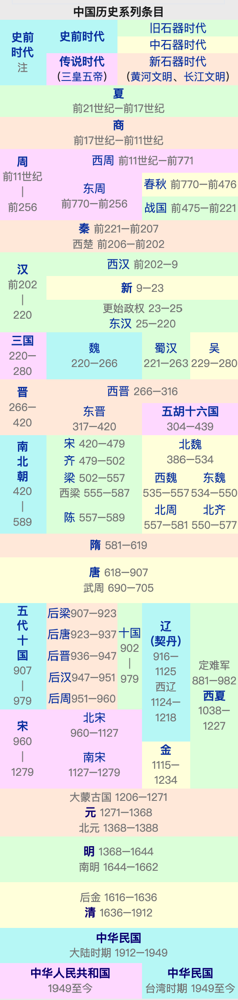
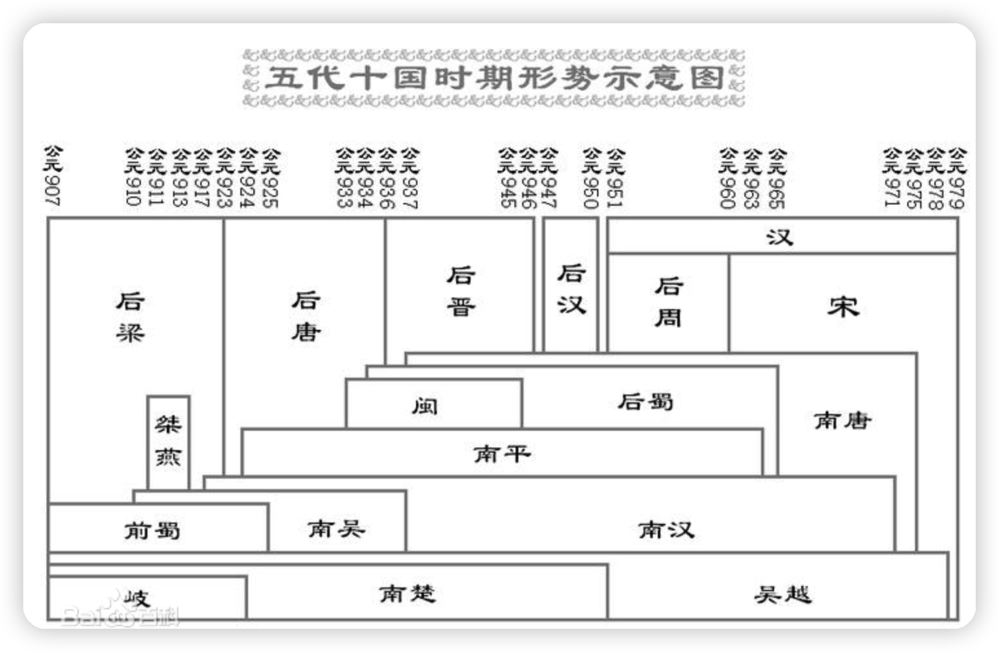

中国历史的长度没有统一定论，因为根据不同的计算方法，有着不同的长度。

从中国第一次建立大一统中央集权制帝国的秦朝开始算起约有2200年；从中国第一次使用文字，并成为信史的商朝算起约有3500年；自拥有二重证据法证明的夏朝算起约有4200年；从孔子所说的、有着三皇五帝的传说时代算起约有4600年；从盘古、上帝、女娲等目前还不确定的神话时代算起约有5000年（这也是在一般中国人的认知中、中国历史传统意义上的长度）；从标志着人类文明萌芽的新石器时代彭头山文化算起约有9500年；而从人类开始脱离原始生活的旧石器时代蓝田猿人文化算起约有80万年的历史。

<!-- more -->

# 1. 概论

中华文明的最早起源至今仍没有定案。虽然传统文献中关于夏朝的记载较多，但由于都成书较晚，迄今为止没有发现公认的夏朝及其之前的历史确实存在的证据，因此近现代历史学界一直有人质疑夏朝存在的真实性。许多中外历史学家认为，河南省偃师市二里头遗址可能是夏朝都城的遗迹，不过目前仍在寻找确凿的依据来厘清。亦有观点认为夏朝之前存在虞朝。

### 1.1 起源

三皇五帝属中国上古时期，由于对这一历史时期现存的资料大多和神话传说纠缠在一起，许多事情很难判断真伪。

三皇时代处于约6000年前到4000年前，是中华文明的萌芽发展期。历史资料表明，漫长的三皇时代是母系氏族社会到父系氏族社会的转变期，如早期的女娲也常被列为三皇之一，这个传说纪录了母系部落的特征。到五帝时代，已经是父系的部落联盟社会。

### 1.2 总揽图 

# 2. 朝代

### 2.0 夏470（前2070-前1600）

夏是中国传统史书中记载的第一个中原部族。

### 2.1 商554（前1600-前1046）

在商代，中国开始首次出现青铜文明。大约在公元前1600年，商汤灭夏，取代了夏朝。

自西伯周文王始图灭商。文王次子周武王承袭乃父之志，牧野之战后，纣王自焚，商朝从此灭亡。周王朝建立。

### 2.2 周789（前1046-前256）

周朝是中国历史上继商朝之后的王朝，也是最后一个完全施行封建制度的世袭王朝，可分为西周（约前1046年－前771年）与东周（前770年－前256年）两个时期。

##### 1.1 西周275（前1046-前771）【烽火戏诸侯，褒姒七夕夭】

前771年，周幽王宠美人褒姒，西周覆亡，国祚约二百五十一年。

##### 2.1 东周514（前770-前256）

周平王元年（前770年）东周开始，由于后世的史家往往又把东周这段时期划分为春秋和战国两个时期，所以又称这段时期为春秋战国时期。春秋时期，周王室还有一点号召力，到了战国时期，连一点号召力都没有了。

##### 2.2 春秋294（前770-前476）

前770年，先后有五个国家称霸，即**齐**、宋、**晋**、**楚**、秦（又有一说是齐、晋、楚、吴、越），合称春秋五霸。

齐桓公小白，晋文公重耳，楚庄王侣。

##### 2.3 战国254（前475-前221）

前403年，晋国被三个门阀巨卿瓜分，成为韩、赵、魏三个诸侯国。韩、赵、魏、齐、秦、楚及燕，并称战国七雄，战国时期正式开始。

秦国最终在秦始皇的统治下，于前221年凭借王翦父子消灭六国，完成统一，中国历史进入新的时代。

### 2.3 秦14（前221-前207）【秦始皇两个儿子夭】

秦王政陆续攻灭六国（前230年至前221年）而一统天下，建立秦朝，结束战国时期，中国从此进入统一时代。

前206到前202年刘邦与项羽之间爆发了争夺天下的战争，史称“楚汉之争”，最后刘邦取胜。

### 2.4 汉406（前202-220）【刘邦爱上了秦始皇车前的铃儿】

汉朝是中国第一个在文治武功与国际声望达到极为辉煌的时代，也是中国历史分野上被视为上古时期转折到中古时期的第一个朝代。由于中间历经王莽篡汉的短暂中断过程，所以又分为西汉（又称前汉）及东汉（又称后汉）。

##### 1.1 西汉211（前202-9）

前202年汉高祖刘邦正式称帝，立国号“汉”，西汉建国。

汉文帝和儿子汉景帝在位期间史称“文景之治”，是中国成为大一统帝国时代以来，第一次被传统历史学家赞誉的时期。

汉景帝其子刘彻（汉武帝）“罢黜百家，独尊儒术”，使汉朝成为当时的东亚霸主。

汉昭帝刘弗陵，汉宣帝刘病已期间，国家经济得以从武帝中期以来面临衰退的困境下的明显恢复，史称“昭宣中兴”。

前1年八月，汉哀帝去世。王莽迎接中山王刘衎即位，是为汉平帝，改元元始。（**就在这一年，遥远的西方社会，耶稣诞生。**）

9年1月，王莽逼迫孺子婴退位，篡汉自立新朝，西汉结束。

##### 2.1 新朝14（9-23）

23年，新朝被刘玄为首的叛军推翻，刘玄成为更始帝。

25年赤眉军立刘盆子为帝，随后击败绿林军。更始帝刘玄向赤眉军投降，通常刘玄被认为是西汉最后一位皇帝。

##### 3.1 东汉195（25-220）【位面之子拉着二胡复国】

25年刘秀复辟汉朝，定都雒邑，史称东汉，而他后被称为汉光武帝。史称"光武中兴"。

汉明帝和汉章帝在位期间，东汉进入全盛时期，史称“明章之治”。

184年爆发由太平道教主张角引发的黄巾之乱。

220年十一月，曹丕篡汉，迫汉献帝刘协禅让”帝位，东汉结束，四百多年的汉朝国祚也正式告终。

### 2.5 三国60（220-280）【曹丕称帝发电220v】

  刘备于223年病死，辅佐其子刘禅的诸葛亮于同年再与孙权恢复同盟。

  263年司马昭为建立军功准备篡位，发动魏灭蜀之战，蜀汉亡。

  265年司马炎废魏元帝自立，国号晋，史称西晋，曹魏亡。

  西晋于280年发动晋灭吴之战，灭亡孙吴，统一中国。至此三国时期结束，进入晋朝。

### 2.6 两晋153（266-420）

##### 1.1 西晋50（266-316）【司马炎的儿子666，266】

265年，司马炎逼迫魏元帝曹奂禅位，国号晋，即晋武帝。【统一】

291-306年开始八王之乱，后造成五胡乱华的局面，大量百姓与世族开始南渡。

316年，西晋灭亡，北方从此进入五胡十六国时期。

##### 2.1 东晋103（317-420）【司马睿317新政后去北京买房】

317年，晋朝宗室司马睿于建康称帝，东晋建立，据有中国南方的领土。【南方】

##### 2.2 十六国135（304-439）

八王之乱的爆发，使晋廷失去在地方的影响力，胡族陆续叛变。

“五胡”为匈奴、鲜卑、羯（匈奴分支）、羌和氐。代表建立北方诸国的主要民族。将此时期称为五胡乱华。【北方】

十六国主要分布在华北地区和四川地区，共有前凉、成汉、前赵、后赵、前燕、前秦、后燕、后秦、西秦、后凉、南凉、西凉、北凉、南燕、北燕、胡夏。

北魏立国后，最后于439年统一华北，进入南北朝时期。

### 2.7 南北朝169（420-589）

##### 1.1 北朝150（439年—589年）

承继五胡十六国，为胡汉融合的新兴朝代。包含北魏、东魏、西魏、北齐和北周等五朝。【北方】

北周武帝去世后，汉人杨坚掌握朝廷，通过授禅北周静帝建立隋朝，经营八年之后，发兵灭 南陈 统一中国。

##### 1.2 南朝169（420年—589年）【刘裕毒杀东晋皇帝，死了都爱你，420】

东晋后期，刘裕崛起平定诸乱，迫使晋帝禅位，篡夺了东晋政权，建立刘宋。进入了南北朝时期。

包含宋、齐、梁、陈等四朝。【南方】

### 2.8  隋朝38（581-619）

581年，杨坚取代北周建立隋朝，定都长安，杨坚成为隋文帝。589年隋朝灭南朝陈，统一天下。

隋文帝节俭，令全国节俭成风。积存粮食数千万石之多，是中国历史上最富一朝。这一时期史称“开皇之治”。

隋朝国祚只有三十八年，是继秦朝后的另一强大而短暂的大一统王朝。

### 2.9 唐朝289（618-907）【见糖留一把618】

617年李渊在太原起兵，建国唐朝，即唐高祖。都城大兴改名为长安。

626年李世民发动玄武门之变。李渊禅让帝位，李世民继位，即唐太宗。贞观时期国家安定，经济得到恢复和发展，史称“贞观之治”。 

##### 武周15（690-705）

690年武则天即皇帝位，改国号为周，即武周。武则天成为中国历史上唯一的女皇帝。在武则天掌权与称帝的期间，国家较贞观时期有更大的发展。武则天晚年，705年退位，史称神龙革命。

712年李隆基即位，即唐玄宗。唐玄宗使唐朝在开元年间进入全盛时期，人口大量增长，物产丰富，史称"开元之治"。

742年唐玄宗改元天宝。755年11月，安禄山以讨伐杨国忠为由发动叛乱，史称安史之乱。唐玄宗紧急南逃蜀地成都，途中发生马嵬驿之变，杨国忠与杨贵妃在愤怒士兵的要求下被杀。

805年唐顺宗李诵继位，唐代宗遗留下来的问题越来越严重，唐顺宗与唐宪宗都企图解决，其中唐宪宗较为成功，实现了元和中兴。

846年唐宣宗即位，859年唐宣宗因服用丹药过度而去世。是时唐朝又出现短暂的复兴景象，史称大中之治。

904年朱全忠逼迫唐昭宗迁都洛阳，长安城被毁。朱全忠本想等统一后再夺取帝位，但因征淮南失利，于907年逼迫唐哀帝禅让，建国后梁，唐朝亡，国祚二百九十年。唐朝灭亡后，五代十国时期开始。

### 1.2.10 五代十国72（907-979）

##### 1.1 五代53（907-960）

从唐朝灭亡至北宋建立半个多世纪期间，中原地区依次出现五个朝代，史称后梁、后唐、后晋、后汉、后周。

907年军阀朱温（朱全忠）篡唐，建立后梁。908年，王建称帝反梁，国号蜀，史称前蜀。

923年，李存勖并进兵汴京，朱温子朱友贞自杀，后梁灭亡，李存勖定都洛阳，定国号唐，史称后唐（923年－937年）。

936年，军阀石敬瑭与后唐皇帝闹翻，联合契丹人攻打洛阳，后唐灭亡，石敬塘建后晋。

947年，大将刘知远乘几率军入汴京，建立后汉。

950年，郭威发动兵变，夺得帝位，建立后周。

960年，后周世宗死后，赵匡胤发动兵变，夺得帝位，建立宋朝，五代结束。

##### 1.2 十国72（907-979）

在五代及宋初，其中前蜀、后蜀、南吴（杨吴）、南唐、吴越、闽国、南楚（马楚）、南汉、南平（荆南）、北汉等十个割据政权被统称十国。

979年，宋太宗消灭北汉，统一中原，至此五代十国时期结束。

> 南唐（937年－976年）是五代十国的十国之一。李煜在南唐灭亡后被北宋俘虏，但是却成为了中国历史上首屈一指的词人，后人誉为千古词帝。

### 2.11 宋319（960-1279）

宋朝是继唐朝后又一个长达三百年的皇朝，分为北宋和南宋。960年，后周大将赵匡胤发动兵变建立北宋，是为宋太祖。

##### 1.1 北宋167（960-1127）

宋神宗时，因王安石变法增加社会的不安，新旧党争长达三十多年，影响深远，也使改革失败。

北宋虽然曾多次出兵讨伐辽和西夏，但均以失败告终，其后不得不向日益坐大的辽和西夏交纳岁币，以维持和平。

1125年，金国灭辽国。之后金国开始进攻积弱的北宋。

1127年，金国攻破北宋首都汴京，俘虏三千多名皇族，其中包括当时的皇帝宋钦宗和太上皇宋徽宗，史称靖康之变，北宋至此灭亡。

> 传说宋徽宗赵佶十分喜欢青楼女子李师师，另外自创“瘦金书”字体。

##### 1.2 辽209（916-1125）

916年，耶律阿保机建立契丹国，称帝建元，即辽太祖，成为中原最大威胁。

1005年，辽朝与北宋签订澶渊之盟，从此宋辽的和平局面长达一百多年。

1125年，金太宗俘虏辽天祚帝，辽亡。立国凡二百一十年。

1124年，余部在耶律大石率领下，经漠北可敦城西征中亚，建立西辽，最终亡于大蒙古国。(西辽1124-1218)

##### 2.1 南宋152（1127-1279）

1127年，宋钦宗之弟赵构即皇帝位，是为宋高宗，定都临安（今浙江省杭州市），史称南宋。

1142年，宋金达成绍兴和议，导致宋金南北分治的局面。

1234年，蒙古与南宋联合灭金。随即蒙古与南宋对抗。

1271年，忽必烈建立元朝，定都大都（今北京）。

1279年，元军与南宋崖山海战，偏安江南一百五十年的南宋随之灭亡。

##### 2.2 西夏189（1038-1227）

李元昊不断开拓疆土，于1038年称帝，国号夏，史称西夏。先后在战争中迫使宋辽两国与其议和，此后西夏采取依辽和宋的政策，换取了几十年的和平。

夏崇宗时期金国兴起并一举灭掉辽国、北宋。西夏向金国称臣，趁机大幅扩张领土，夺取宋辽故土，进入盛世时期。

1226年，成吉思汗率大军围困中兴府达半年，西夏1227年6月向蒙古投降，西夏亡。立国一百九十年。

##### 2.3 金119（1115-1234）

完颜阿骨打于1114年起兵反辽。1115年完颜阿骨打称帝，建国大金，都会宁府（今黑龙江省哈尔滨市阿城区南白城子）。

1125年灭辽。1127年俘虏徽钦二帝北去，北宋亡。

1211年，蒙古大举攻金，金军主力被全歼，被迫求和。

1234年，蔡州城破，金亡。立国一百二十年。

### 2.12 元97（1271-1368）

##### 大蒙帝国65（1206-1271）

1206年成吉思汗统一漠北诸部，建立大蒙古国。于1227年8月攻灭西夏，1234年3月攻灭金朝，完全领有华北。在西方，蒙古先后发动三次西征，使蒙古帝国称霸欧亚大陆。

1260年5月5日忽必烈在部分宗王和蒙汉大臣的拥立下自立为蒙古皇帝，年号中统。

##### 1.1 元97（1271-1368）

忽必烈汗为了成为中国皇帝而推行汉法，改元建号。1271年，忽必烈将国号由大蒙古国改为大元，建国元朝，忽必烈即元世祖。

1294年元世祖驾崩，元成宗继位。在内政方面专力整顿国内政治，减免江南部分赋税。然而由于过度赏赐，入不敷出，使国库资财匮乏。

1311年元武宗逝，由皇太弟爱育黎拔力八达继位，是为元仁宗，这次是元朝首次和平继承帝位。

1323年元英宗在上都以南的南坡被刺杀，史称南坡之变。

元朝长期处于继承权问题、贪污、权臣擅政的恶习，使得政治总是无法上轨。1351年红巾军的起事，揭开元朝灭亡的序幕。

朱元璋统一江南后于1367年下令北伐，明军于1368年八月攻陷元大都，元惠宗北逃，史书称此为元朝结束之年。

##### 2.1 北元20（1368-1388）

元惠宗北走上都。因国号仍称“大元”，以其地处塞北，故称之为“北元”。

此时的北元仍控制着中书省的西部地区、岭北行省、辽阳行省、甘肃行省、陕西行省，以及位于西南的飞地云南行省等省份，仍保有一定的力量，与明朝南北对峙，这是中国历史上又一个南北朝时期。

1388年，阿里不哥后裔也速迭儿杀害元天元帝，废除大元国号，国号复称“蒙古”（明朝称之为“鞑靼”），北元灭亡。

### 2.13 明276（1368-1644）

1368年，朱元璋于南京称帝，即明太祖，年号洪武，明朝建立。同年攻占元大都，元朝势力撤出中原，在全国的统治结束。

明太祖洪武帝即位后减轻农民负担，恢复社会的经济生产，改革元朝留下的糟糕吏治，社会经济得到恢复和发展，史称"洪武之治"。

1398年洪武帝驾崩，燕王朱棣占领京师，是为靖难之变。朱棣即位，即明成祖，年号永乐，永乐盛世。

1425年，明成祖长子明仁宗与明宣宗相继兴起，仁宣之治，明朝兴盛。

1449年，明英宗朱祁镇于北伐瓦剌时在土木堡战败被俘，明朝开始衰落，疆域不再扩张，并加强边防及修筑明长城。

1449年，于谦立英宗之弟明景帝即位。英宗回到北京后，软禁中的他在1457年发动夺门之变复辟，改元天顺。

英宗之后的成化帝早年勤政，国势尚可。成化帝死后，其子弘治帝勤于政事，开创弘治中兴。

1556年陕西省华县发生约8级的大地震，人员死伤极为惨重（死亡83万人），对明朝的国力和财政状况亦造成不同程度的影响。

1572年，隆庆帝和万历帝初期，在内阁首辅高拱和张居正及宦官冯保的辅政之下曾一度中兴，国势鼎盛，此时银钱透过国际贸易流入中国，明朝经济达到全盛。

1620年，天启帝明熹宗即位，任用宦官魏忠贤来分担朝廷的业务，造成东林党争，政治更加腐败，国势更衰。

1644年，起义首领李自成攻克北京，明思宗崇祯帝朱由检自缢身亡，历二百七十七年的明朝灭亡。

南方大臣先后拥护福王朱由崧、唐王朱聿键、桂王朱由榔为帝，史称南明（1644-1662），最终因实力不足及政治内斗为清军所灭。

明朝旧臣郑成功从褔建沿岸厦门和金门攻取台湾，郑成功死后，他的孙子郑克塽投降清军，大清王朝将台湾并入中国版图。

### 2.14 清276（1636-1912）

1616年努尔哈赤在今中国东北地区建国称汗，建立后金，定都赫图阿拉（今辽宁新宾）。后金（1616-1636）

1626年，努尔哈赤于宁远战役中被袁崇焕的红衣大炮击败，不久逝世。

1636年，皇太极在盛京（沈阳）称帝，改年号为崇德，国号为大清。

1643年，皇太极病死，在其长子豪格，及其弟多尔衮的一场政治斗争后，由第九子福临继位，是为顺治帝。

1644年，吴三桂引清兵入关，清朝将首都迁到北京，清朝入主中原。数十年时间内，陆续消灭了农民军、南明和明郑等势力。

1661年，康熙帝即位，1669年始亲政。进入康雍乾时期，这段时期是清朝发展的高峰时期，称为康雍乾盛世。

1722年，康熙帝传位于胤禛（甄嬛传之四阿哥），即雍正帝。

1735年，乾隆帝弘历继位。乾隆帝在位时期是清朝的全盛时期。人口不断增加突破三亿大关，约占当时世界人口的三分之一。乾隆期间清朝疆域达1300万余平方公里，东方的朝鲜与琉球国也早就成为藩属国之一。

1796年，乾隆皇帝禅位于嘉庆皇帝。然而嘉庆帝未能解决弊端，在乾隆帝驾崩后，清朝继续走向衰退。

1840年6月，英国政府发动鸦片战争。

1851年，受到基督教影响的秀才洪秀全建立拜上帝会，发动金田起义并创建太平天国。

1860年，英法联军在八里桥之战中打败清军，随后攻破北京城，放火烧毁圆明园，咸丰帝逃至承德。

1864年7月，曾国藩弟曾国荃率湘军攻陷天京，对无辜百姓展开屠杀与抢掠，太平天国才正式结束。

1860年代，清朝开始推行洋务运动，国力有所恢复，并一度出现同治中兴的局面。1877年清军收复新疆。

1895年，中日甲午战争的失败，此后，列强纷纷强租土地，意图瓜分中国。

1898年，光绪帝在亲政后同意康有为、梁启超等人提出的变法主张，但最终在慈禧太后发动政变后失败落幕。

1899年，义和团运动爆发，在慈禧太后包庇下围攻外国驻北京使馆。各国以解救驻京使馆和外使人员被杀攻入北京，史称八国联军。

1909年，地方科举考试停止以后，西学逐渐成为学校教育的主要形式。正是教育方式的这一根本性转变，为后来风起云涌的辛亥革命和国家建设培养造就了大批思想进步、锐意创新的社会精英和宝贵人才。

1912年1月1日，亚洲第一个共和国中华民国在南京宣告成立，孙中山正式就任首任临时大总统。2月12日，清宣统帝溥仪宣布退位，清朝正式走进历史，中国两千多年的帝王专制制度也基本结束。

### 2.15 中华民国

1905年中国同盟会成立以后，革命党开始兴起，孙中山和黄兴等人在海外积极筹款，组建党组织，指挥国内的多次革命运动。

1912年1月1日，亚洲第一个共和国中华民国在南京宣告成立，孙中山正式就任首任临时大总统。

1919年五四运动爆发。1921年，中国共产党的成立。一部分中国大陆的历史学家将五四运动誉为中国现代史的开端。

+ 北洋政府时期

  1912年4月1日，孙中山在南京辞去担任3个月的临时大总统职位，由袁世凯接任，并定都于北京，故又称北京政府。

  孙中山组织中华革命党讨伐是为二次革命，同年3月，袁世凯被迫宣布取消帝制，6月在绝望中死去。

  袁世凯死后黎元洪继任总统之位，段祺瑞则成为国务总理。地方政府则由各个军阀派系割据。

+ 外蒙古独立

  1924年蒙古人民革命党宣布废除君主立宪制，成立蒙古人民共和国，定都库伦，改城名为乌兰巴托。

  1946年外蒙古独立。1961年，蒙古人民共和国成为联合国会员国。

+ 国民政府时期

  1926年6月，蒋中正率领国民革命军从广东发起北伐战争，到1928年进占京津，大体上统一中国。

  共产党发动数次起义均告失败，于是转入江西井冈山等山区，实行工农武装割据，并于江西瑞金建立中华苏维埃共和国。

  1935年中华苏维埃共和国更名为中华苏维埃人民共和国；1936年又更名为中华苏维埃民主共和国。

+ 第二次世界大战

  1931年9月18日，日本发动九一八事变，出兵占领东北三省，满洲国于次年成立，日本扶植溥仪成立的第一个傀儡政权。

  1940年至1945年间，汪精卫政权（日本军扶植的傀儡政权）”，在南京建立所谓的“中华民国国民政府”。

  1945年，第二次世界大战结束后，中国从日本手里接管台湾及澎湖列岛以及其他一些领土，废除百年不平等条约，而且得以成为联合国安全理事会5个常任理事国之一，号称“世界五强”之一。

  1949年4月，解放军发动渡江战役，占领首都南京总统府。10月1日，中华人民共和国中央人民政府主席毛泽东在北京宣布中华人民共和国中央人民政府成立。

+ 政府迁台

  国共内战后，中华民国政府搬迁到台湾，以台北市为中华民国首都，也是中央政府所在地。

  1975年蒋中正去世后，由蒋经国接掌政权。随着产业从农业发展到轻重工业、国民教育普及，台湾在1970年代进入经济起飞时代。

  1986年9月28日，台湾第一个反对党民主进步党正式成立。

  1996年，举行第一次总统公民直选，由中国国民党籍的原总统李登辉当选连任。

  2000年，中华民国第二次总统民选，由在野党民主进步党所推举的陈水扁当选。

  2008年，提出“不统、不独、不武”的中国国民党所推举的马英九当选总统，两岸关系缓和，对外关系亦大幅改善。

  2016年，民主进步党籍的蔡英文当选总统，三次政党轮替。

### 2.16 中华人民共和国

1949年10月1日，在北京天安门广场举行开国大典，中华人民共和国正式成立。

1950年代开始的土地改革运动将地主的土地没收，改变了两千多年来“皇权不下县”的局面，国家政权的动员力从此深入村镇基层。

1953年开始，中共开始实行土地集体所有制，再次剥夺了农民的土地。

1950年的昌都战役消灭藏军主力后，1951年同西藏政府达成《关于和平解放西藏办法的协议》，对西藏取得控制权。

1957年，反右运动展开，上百万知识分子和民主党派人士等遭到批斗和迫害，中国大陆的民主制度遭到严重破坏。

1958年，中国共产党中央委员会主席毛泽东发动“大跃进”运动与“人民公社化”运动，造成了三年大饥荒内数千万人的死亡。

1966年，文化大革命爆发，四人帮成为新的重要政治势力，中华人民共和国政治进一步混乱。

1976年，国务院总理华国锋接替毛泽东的领导地位，出任中国共产党中央委员会主席，成为最高领导人。

1978年，中共十一届三中全会召开，重新上台的邓小平执掌政权，改革开放时代正式到来。

1989年，江泽民出任中国共产党中央委员会总书记，以其为核心的中共第三代中央领导接掌政权。

2002年，中共十六大后，以胡锦涛为总书记的第四代中共中央领导集体上台此时中国经济改革已经有显著效果，人均生活水平大幅提高，外汇储备世界第一，被誉为“世界工厂”，成为世界上最有发展潜力的国家之一。

2008年，第29届奥林匹克运动会在北京开幕，中国展示了经济发展的成绩、自信以及史无前例的开放心态，公众也表现出对政府少有的包容和支持。

2010年，上海世界博览会在上海举行，是中国首次举办的综合性世界博览会，也是首次由发展中国家主办综合性世博会，共有256个国家和地区及国际组织参展。

2012年，中共十八大后，习近平出任中共中央总书记，李克强担任国务院总理，标志着中共第五代领导集体上台。

# 3. 参考资料

+ https://zh.wikipedia.org/wiki/%E4%B8%AD%E5%9B%BD%E5%8E%86%E5%8F%B2
+ https://zh.wikipedia.org/zh-sg/%E4%B8%AD%E5%9B%BD%E6%9C%9D%E4%BB%A3
