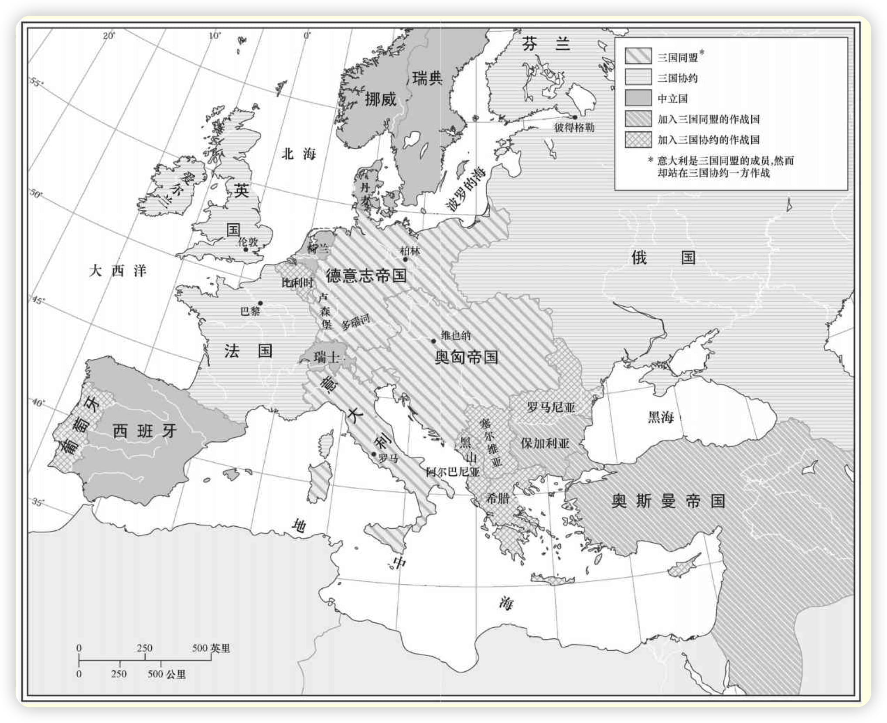
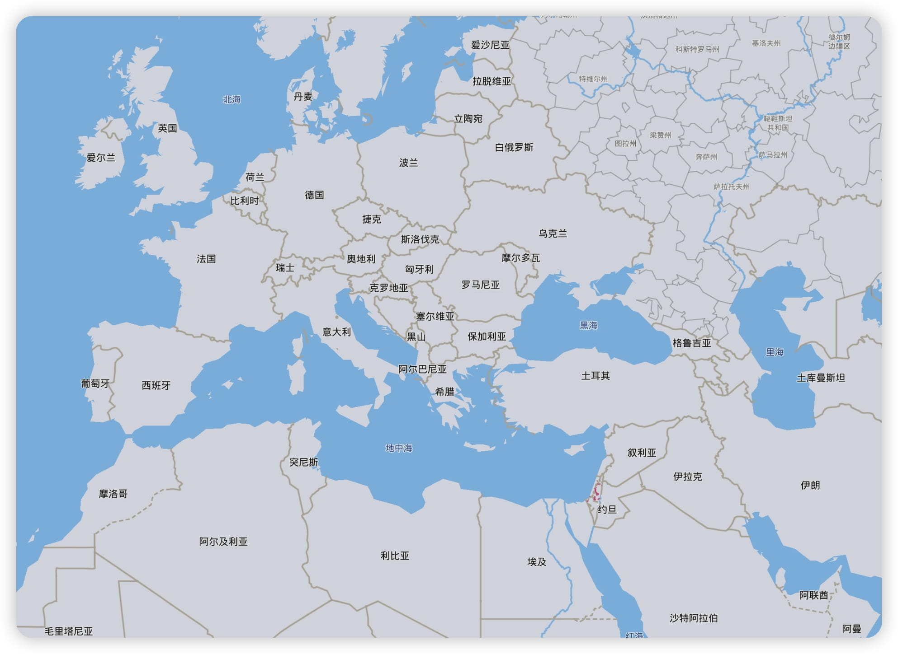
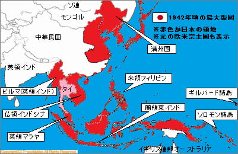

全球的一体化前所未有，导致了西方的技术、观念和制度正以加速度扩散。但是反过来，也正是这种扩散逐渐削弱了1914年之前似乎不可侵犯的西方全球霸权。诸殖民地民族正在有选择地采纳西方文明来对西方进行更有效的抵抗。因此，1914年以来的世界历史既是西方成功的历史，又是西方衰落的历史。
<!-- more -->

# 1. 第一次世界大战：全球性影响【1914-1918】

用亚洲人的观点来看，1914年至1918年的第一次世界大战是欧洲民族共同体内的一场内战。

1914年的欧洲

### 1.1 相互冲突的联盟体系

联盟体系始于1879年德国宰相奥托·冯·俾斯麦与奥匈帝国缔结两国同盟条约之时。这是一个防御性的盟约，旨在保护德国免受法国人的攻击，因为后者想收复1871年失去的阿尔萨斯——洛林地区。这个条约还旨在保护奥匈帝国免受俄国人的攻击。

1882年，两国同盟因意大利的加入而变成三国同盟。它的目的还是防御：保护意大利免受法国的攻击，因为意、法两国在突尼斯发生了尖锐的冲突。

1894年法俄同盟缔约成立，它的两个目的是反对三国同盟和抵制英国对殖民地的争夺。法俄同盟因1904年英法协约和1907年英俄协约的签订而成为三国协约。

### 1.2 萨拉热窝

1914年6月28日，奥匈帝国皇储弗朗茨·斐迪南和他的妻子在萨拉热窝。在这一天较晚些时候，皇储夫妇被塞尔维亚人培训和指使的青年革命分子刺杀，点燃了导致第一次世界大战的导火线。

7月23日，奥匈帝国向塞尔维亚发出最后通牒，包含若干苛刻的条件。塞尔维亚7月25日的答复几乎接受所有条件，但拒绝奥匈帝国官员在塞尔维亚领土上参与调查该案的要求。奥匈帝国立刻断绝同塞尔维亚的外交关系，并于7月28日向塞尔维亚宣战。

塞尔维亚的背后是俄国，而俄国的背后是法国和英国。同样，奥匈帝国也有德国支持，理论上还有意大利支持。因而，民族自决与相互冲突的联盟体系的结合使欧洲陷入大屠杀之中。

俄国为了报复，于7月30日命令全国总动员。第二天，德国向俄国发出为期12个小时的最后通牒，要求停止总动员。德国没有得到答复，于8月1日向俄国宣战，并于8月3日向俄国的同盟国法国宣战。

就在同一天，德国入侵比利时，开始了实际的战争行动。英国人在德国卷入后开始干预，但他们这么做，公开的借口并不是与法国的秘密军事承诺，而是对德国人入侵比利时的反应，这更宜为英国公众所接受。这样，欧洲列强在萨拉热窝刺杀事件过去5个星期时就已开始互相进攻。

### 1.3 战争的欧洲阶段：1914—1917年

##### 1.3.1 1914年：西线的消耗战

第一次世界大战开始时，双方诸民族都满怀信心地期待着一场短暂而又胜利的战争。但是，他们不久便发现自己卷入了一场持久而残酷的折磨之中，在这场战争中损失的财富和伤亡的人数是前所未有的。

前四个月中西线的伤亡人数为：德国70万人、法国85万人、英国9万人。与各总参谋部的计划相反，西线的战斗这时变成了阵地战和消耗战。

在俄国战线和巴尔干战线。俄国人一开始就以惊人的速度和强有力的攻势攻入东普鲁士。这一战略很奏效，导致德国人从比利时调集了四个师去支援东线。

在巴尔干战线上，奥地利人25万人渡过德里纳河，进入塞尔维亚。但是，他遭到了35万塞尔维亚军队的抵抗，他们当中90%的人是参加过1912年至1913年巴尔干战争的老兵。在不到两个星期中，这些塞尔维亚人就迫使奥地利人在损失三分之一兵力的情况下退回到德里纳河以西。

##### 1.3.2 1915年：东线上俄国的退却

1915年的一些战役为德军新任总司令埃里希·冯·法金汉所左右。鉴于西线上的僵持局面，把兵力集中到了东线，力图击败俄国人。俄国除军事上共伤亡250万人外，还丢失了15%的领土，损失了10%的铁路，失去了30%的工业，丧失了20%的平民人口。沙皇专制政权遭到了使它再也无法复原的打击。

西线的消耗战仍在继续。法国的霞飞将军坚信，密集的炮火轰炸加上大部队的正面攻击必将带来胜利。但是，接二连三的进攻并未使战线发生变化，结果只是人员伤亡惨重。

1914年11月2日，土耳其加入同盟国，第一次世界大战参加了著名的达达尼尔战役。保加利亚于1915年10月14日加入同盟国。这一介入意味着塞尔维亚人的末路。10月6日，德国、奥匈帝国和保加利亚军队以压倒优势的兵力从三面进攻塞尔维亚。到年底时，整个国家全被占领。

尽管意大利人表面上曾是同盟国的盟友，但战争一开始他们就决定保持中立。协约国这时慷慨地提出将这些领土以及战胜土耳其后的另外一些领土分给意大利。意大利决定加入协约国的阵营，使协约国的力量得到加强。

##### 1.3.4 1916年：凡尔登战役和索姆河战役

1916年2月，德国人发动了对法国要塞凡尔登的全面进攻。英国人则以对索姆河西北地区的攻势进行反击。但是，防守再次被证明比进攻更有优势。1916年的这两次战役使德国死伤约85万人，英法死伤约95万人。然而，任何一方向前的推进都未超过7英里。

与此同时，俄国军队在勃鲁西洛夫将军的领导下，在东线展开了一次成功的攻势。德国人在凡尔登战役中的失败和勃鲁西洛夫的进攻所获得的意外成功促使罗马尼亚于1916年8月27日站到了协约国一边参战。

同盟国这时决定教训一下罗马尼亚，以警告其他企图效仿罗马尼亚做法的中立国。德国、奥匈帝国、保加利亚和土耳其军队以压倒优势的兵力突然袭击了罗马尼亚。到这一年年底，罗马尼亚人已丢失了三分之二的国土，其中包括他们的首都。

1917年6月27日，希腊也站到了协约国一边参战，从而为1918年进攻马其顿、迫使保加利亚退出战争铺平了道路。

##### 1.3.5 1917年：流血和失败主义

1916年，德国人曾在凡尔登采取攻势，而现在，1917年，协约国却处于领先地位。

德国人已用领导东线部队的兴登堡和鲁登道夫取代了法金汉。法国、英国和加拿大军队按照预定计划跃出壕沟发动进攻，但却遭到了自大战以来最惨重的一次失败。兴登堡的防御战略对德国人非常有用。他们使协约国蒙受了40万人的伤亡，而己方只伤亡了25万人。

到这时，欧洲各民族已经进入了历史上最具毁灭性、最残酷的战争的第四个年头。人们尽管付出了种种牺牲，遭受了种种灾难，但还是看不到战争的尽头。

### 1.4 战争的全球阶段：1917年的俄国革命

1917年因两个重大的事态进展——俄国革命和美国参战——而被证明是决定性的一年。这些事件改变了战争的性质——最初主要为欧洲问题而开战，实质上是欧洲的事务，这时转变成全球范围的战争。

##### 1.4.1 **1917年的二月革命**

1917年，俄国爆发了两次革命：第一次在3月（俄历2月），结束了沙皇专制统治，成立了临时政府；第二次在11月（俄历10月），推翻了临时政府，确立了苏维埃政权。

##### 1.4.2 两次革命之间

1917年3月至11月是临时政府和人民党的革命团体即苏维埃之间为权力而斗争的时期。

4月16日，列宁回到彼得格勒并发表了他那著名的“四月提纲”，提出了立即实现和平、将土地分给农民和全部政权归苏维埃的要求。到1917年年底时，许多人都在准备为“一切权力归苏维埃”而战斗，以摆脱临时政府，因为临时政府阻碍了人们获得极为向往的和平和土地。

##### 1.4.3 **1917年的布尔什维克革命**

李沃夫和克伦斯基组成了新临时政府。新临时政府一直执政到7月20日。从7月20日起，一直以有影响的掌权者形象出现的克伦斯基组成了一个以他自己为总理的新政府。

到10月时，他们已在彼得格勒和莫斯科的苏维埃中占据多数。列宁这时断定，推翻克伦斯基、实现社会主义革命的时机已经来临。起义日期被定在11月7日。

新的布尔什维克政府采取的首批措施中的一个就是履行和平的诺言。1918年3月3日，它同德国签署了《布列斯特-立陶夫斯克和约》，该和约严厉的条款要求俄国交出波兰、波罗的海沿岸诸省、芬兰、乌克兰和高加索部分地区。交出的地区包括6200万人口和125万平方英里的领土；更具灾难性的是，这些地区蕴藏着俄国四分之三的铁和煤。它们还包括俄国一半的工厂和三分之一的产粮区。

俄国便退出了第一次世界大战，新的布尔什维克统治者着手创立苏维埃社会主义共和国联盟。

### 1.5 战争的全球阶段：美国的介入

第一次世界大战开始时，威尔逊总统立刻号召他的同胞严守中立。到了1917年时，威尔逊本人却正在将这个国家引向战争。

赞成介入战争的还有美国的金融家和工业家，他们一直在用赊销的方式向英国和法国提供军用物资，如果他们的顾客战败了，他们也将破产。德国无限制的潜艇战导致美国人员和船只的损失也加速了美国的参战。

在1918年3月，共计84889名美军到达西线，6月，这个数字上升到306350人。这样，协约国的指挥官每月都可得到一支新的生力军。不出所料，1918年同盟国一个接一个地投降了。

这样，第一次世界大战便宣告结束——这场战争历时4年零3个月多，涉及30个主权国家，推翻了4个帝国，产生了7个新的国家，死亡人数为：战斗人员约850万，非战斗人员约1000万，直接经济损失达1805亿美元，间接经济损失达1516亿美元。

### 1.6 和平解决

欧洲地图被大幅度修改。为了让土耳其退出战争，协约国支持阿拉伯人摆脱土耳其获得独立的努力。阿尔萨斯——洛林地区毫无疑问归还给了法国。俄国由于芬兰、拉脱维亚、爱沙尼亚和立陶宛等独立国家的建立而失去了它在波罗的海沿岸的大部分地区。

独立的波兰在前俄国、德国和哈布斯堡帝国割让的诸省领土上成立；捷克斯洛伐克出现在前哈布斯堡帝国的版图上。南斯拉夫也形成了，它由战前的塞尔维亚、黑山和南斯拉夫人居住的各色前哈布斯堡帝国疆域组成。

罗马尼亚因从奥匈帝国、俄国和保加利亚获得领土而使其面积增加了一倍多。最后，在古老的哈布斯堡帝国剩余的地区则出现了奥地利和匈牙利这两个小国家。

第一次世界大战后的欧洲（1923年）

### 1.7 世界历史上的第一次世界大战

欧洲的边界四大帝国的消失【奥匈帝国，奥斯曼帝国，德意志帝国，俄罗斯帝国】。

战争不但在经济上，而且在政治上使欧洲内部遭到摧残。1914年以前，欧洲已是近代基本的政治思想和政治制度的发源地。正如我们所看到的那样，这些思想和制度的影响已波及全球各个角落。然而，战争的浩劫却使欧洲人士气沮丧，失去信心。在欧洲大陆的各个地方，古老的秩序正在受到怀疑和挑战。

欧洲的霸权也被第一次世界大战削弱，因为这次大战对海外殖民地产生了影响。欧洲列强的一个集团同另一集团血战到底的惨状不可弥补地损坏了白种主人的威信。

# 2. 殖民地世界的民族主义起义

第一次世界大战之后，殖民地地区出现了革命的浪潮。

### 2.1 土耳其

第一次世界大战后，在所有反对欧洲人统治的殖民地起义中，土耳其人的起义最为恢宏、最为成功。大战期间，他们遭到了惨败，接着，被迫接受了屈辱的停战协定与和平条约。

然而，他们很快便挽回了败局，在武装冲突中击败了他们的敌人，赢得了一个新条约，有着较为有利的条款。因此，在所有的同盟国中，只有落后且被轻视的土耳其有能力反抗获胜的协约国，迫使它们接受对媾和条约所作的修改。

1914年11月，当土耳其加入同盟国后，英国人便同阿拉伯领导人麦加王子埃米尔·侯赛因协商军事联盟。作为对阿拉伯人反抗土耳其人的回报，英国人同意承认战后各阿拉伯国家的独立。

土耳其成功的一个主要原因是后来被称为“土耳其之父”的穆斯塔法·凯末尔的人格。他因在反对协约国的战争中成功地保卫了达达尼尔海峡而成名。凯末尔在变革的巨大洪流中进行了一个又一个的改革。

首都从易受攻击的君士坦丁堡（今伊斯坦布尔）迁移到小亚细亚中心地带的安卡拉；废除了哈里发制；取缔所有的宗教社团和寺院；与新的民法典、刑法典和商法典一起采用一部宪法；给予妇女以选举权，并允许她们参加议会。至1938年11月10日凯末尔去世时，新土耳其已经确立。

### 2.2 阿拉伯中东

英国人同意承认战后各阿拉伯国家的独立。但这一承诺与英国人对世界犹太复国主义组织的罗斯柴尔德勋爵所作的许诺相冲突。1917年11月2日，贝尔福勋爵写信给罗斯柴尔德勋爵，宣称英国政府赞成在巴勒斯坦建立一个“犹太人的家园，，这一《贝尔福宣言》和协约国之间瓜分奥斯曼帝国的秘密条约都是相冲突的。

在巴勒斯坦本土，随着犹太移民的不断涌入及忧虑重重的阿拉伯人对犹太人和英国人的回击，这种三方间的冲突变得日趋激烈。英国人预料，犹太人的迁移永远不会达到侵犯阿拉伯人“权利和地位”的程度。

阿拉伯人对犹太人的攻击变得愈益频繁和猛烈。英国的反应是在这些大暴动之后派出了皇家专门调查委员会。到第二次世界大战时，几个委员会已对情况进行了调查，他们企图满足三方不同且相互冲突的利益——犹太复国主义者的热望、阿拉伯人的民族主义要求和英帝国的利益，所以他们的建议始终摇摆不定。

### 2.3 印度

1914年，印度齐心协力地支持英国参战。王公们提供了大量的财政援助，同时，至少有90万印度人在英国军队中当战斗员，另外，还有30万印度人当劳工。然而，第一次世界大战结束才过了29年，英国对印度的统治便告结束。

甘地无疑是战后这场反英运动中最杰出的人物，他是现代印度之父。印度民族主义者发生了分裂，印度的许多穆斯林认为，同他们的印度教邻居相比，伊斯兰世界其他地区的人与他们的共同之处更多。

### 2.4 中国

在中国，孙中山于1911年建立了共和国，组织了他的政党国民党。1925年孙中山去世后，蒋介石成为国民党和中国的领袖。在他的领导下，在修建铁路、公路，建立工业，改进公共卫生和教育等方面取得了重大进展。

1921年7月，中国共产党在上海成立。共产党因其“打土豪，分田地”的政策争取了广大农民而幸存下来。在与蒋介石的“围剿”进行了数年斗争之后，毛最终冲出包围，到达西北诸省，在那里艰苦奋斗，建立了根据地。

由于他的土地改革政策和日本人在东部沿海的进攻削弱了蒋的政府，他渐渐地扩大了他的根据地。日本人的侵略和共产党的强大加在一起最终迫使蒋介石于1949年逃往台湾地区，毛泽东成为中国大陆的领导者。

# 3. 1929年以前欧洲的革命与和解

在整个欧洲大陆，旧秩序正受到怀疑，部分是因为世界大战所带来的创伤，部分是因为俄国革命的影响。

### 3.1 共产主义在俄国的胜利

1921年，内战和外国的侵略一直都还在一起蹂躏俄国。但令人意外的是，最后红军却出于各种原因取得了胜利。也许最重要的原因是，布尔什维克【苏联共产党】在争取农民群众的支持方面通常做得更成功。

回想起来，长期的内战和干涉对相关的所有党派都是一场灾难。它使从波罗的海到太平洋的俄国农村荒废，使俄国人民大批死于横祸、饥饿和疾病。同样严重的是新成立的苏联与西方世界之间的关系也在恶化。

苏维埃领导人加深了“资本主义包围”这种马克思主义式的担忧，而西方政治家则对1919年建立的共产国际的无用宣言过于认真。这种相互的不信任既深刻又持久，从而毒化了随后10年的国际关系，大大促成了第二次世界大战的到来。

### 3.2 共产主义在中欧的失败

1914年时的德国社会民主党是欧洲最强大的政党，但它很保守，专心致力于社会改革而不是革命。同样重要的是德国农民的富庶，因此，布尔什维克的“把土地分给农民”的口号虽然在俄国非常有效，但对德国的影响却很小。

德国在1919年1月19日进行了国民议会而非苏维埃代表大会的选举。这样，在德国出现的新国家就是民主的魏玛共和国，而不是一个苏维埃德国。

同样的格局也在奥地利和希腊占上风，出于种种原因，农民政党从未在这两个国家生根。奥地利最后于1934年建立了由陶尔斐斯总理领导的独裁政府，希腊于1936年建立了由迈塔克萨斯将军领导的公然的法西斯政权。这样，到第二次世界大战时，整个中东欧就全处于独裁统治之下，只有一个国家例外，这就是捷克斯洛伐克。

### 3.3 意大利成为法西斯国家

墨索里尼1919年，他建立起第一个“战斗队”，并组织了法西斯党。1922年秋，墨索里尼以尊重君主政体和教会利益的明确保证赢得了国王和教会的支持，从而为一场政变做好了准备。

墨索里尼统治下的意大利的另一个特点是精心设计的市政工程规划，这是为了提供就业机会，竖立令人印象深刻的建筑物，以颂扬法西斯主义。

### 3.4 西欧的民主主义问题

民主制度在西方有着更深的根基，因此，主要的社会结构更健全，并享有更多的民意支持。不过，绝不能因此就认为西欧在战后数年中没有遇到困难。实际上，它也有许多问题，其中最严重的就本质来说是经济问题，尽管它也带来了深远的社会和政治后果。西欧两个主要国家英国和法国的经历可以很好地说明这一点。

### 3.5 欧洲的稳定与和解

在大战刚结束的几年中，欧洲的外交为法国及其中欧和东欧的盟国所支配。由于奥匈帝国的消失、德国和俄国的衰竭，法国这时成为欧洲大陆上的头号强国。

大约在1925年前后，法、德两国的关系有了改善，德国可以加入国际联盟，并成为常任理事会成员。作为回报，德国同意不通过武力来谋求条约的修订，和平解决同法国、比利时、捷克斯洛伐克和波兰的一切争端。

20世纪20年代末期人们普遍有一种感觉，认为欧洲终于恢复到了正常状态：德国和它以前的敌人似乎已经和解；德国加入了国联；赔款问题似乎终于得到了解决；60多个国家已摈弃将战争作为“推行国策的一种工具”；繁荣程度在增长，失业率正相应下降。

# 4. 五年计划和大萧条

### 4.1 五年计划

布尔什维克一旦居于俄国主人的地位，就面临着挑战，要建立起新的社会主义社会，如他们久已宣传的那样。他们很快便发现，他们对迎接这一挑战毫无准备——过去的历史中没有任何模式可循。

注重实际的列宁认识到让步是不可避免的，因而于1921年采取了“新经济政策”（NEP），这一政策允许局部地恢复资本主义。在1924年逝世前不久，列宁似乎已经认定继续实行新经济政策是为社会主义指出的最佳之路。

斯大林清楚地看到，共产党是这个国家唯一的实权力量，他利用党的总书记身份使自己成为党和国家的主人。在经过相当大的动摇之后，斯大林决定放弃新经济政策，支持工业和农业都由莫斯科控制和管理的中央集权经济。

1928年，斯大林开始实行由国家计划委员会制订的一系列五年计划中的第一个。苏联农场用比美国农场多出50%的土地耕种，用10倍的人力劳作，但其产量却只有后者的四分之三。

到1932年第一个五年计划结束时，苏联的工业产量已从世界第五位上升到第二位。这一非凡的激增不仅是因为苏联生产率的提高，而且还由于大萧条所造成的西方生产率的下降。

对苏联人民来说，五年计划是一件祸福兼有的事情。从积极的一面来看，它们使国家在经济和军事上强大起来，从而大大有助于在第二次世界大战中打败希特勒。五年计划还把国家从一个落后的社会变成一个现代社会。

### 4.2 大萧条

20世纪20年代，因不少国家支付战争债务，金钱源源不断地流入美国；美国的黄金贮藏量在1913年至1924年间从19.24亿美元增加到44.99亿美元，占世界黄金总贮藏量的一半。

1925年至1928年间，美国平均每年的对外投资总额达到11亿美元。当然，这种情况最终加强了不平衡，不可能无限持续下去。由于支付款到期，债务国不得不削减从美国的进口，美国某些经济部门，尤其是农业，也就受到了损害。此外，有些国家不得不拖欠债务，这就动摇了美国的某些金融公司。

美国股票市场的崩溃始于1929年9月。一个月内，股票的价值下降了40%，而且，除了少数几次短暂回升外，下跌持续了三年。在此期间，美国钢铁公司的股票从262下降到22，通用汽车公司的股票从73下降到8。到1933年，工业总产量和国民收入暴跌了将近一半，商品批发价格下跌了近三分之一，商品贸易下降了三分之二以上。

这些经济大灾难引发了同样严重的社会问题。其中最严重的是大规模的失业，已达到了悲惨的程度。1933年3月，美国的失业人数据保守的估计为1400多万，相当于全部劳动力的四分之一。在英国，失业人数将近300万，在全部劳动力中所占的比例与美国大致相同。德国的情况最糟，工会成员中有五分之二以上的人失业，另外还有五分之一的人只有非专职工作。

阿道夫·希特勒35岁，在狱中写下了《我的奋斗》。大萧条为他赢得了狂热的听众，拥戴他为元首。1933年1月30日，希特勒成为内阁总理，开始像墨索里尼一样用宣传和恐怖统治德国。

# 5. 走向战争，1929—1939年

由于英国、法国及其欧洲大陆盟国坚持维护现状，德国、意大利和日本努力要求改变现状，因五年计划而变得强大的苏联在国际事务中起着日益重要的作用，出现了一种三足鼎立的局面。这三方力量的相互影响，解释了20世纪30年代一再发生的危机和第二次世界大战最终爆发的原因。

### 5.1 日本入侵中国东北

1931年9月18日晚，在沈阳北部，一场爆炸破坏了日控南满铁路的一小段。日本关东军未经宣战就在24小时内攻占了沈阳和长春，然后成扇形向四面八方展开。1932年1月下旬对哈尔滨的占领终结了东北各种有组织的抵抗。1932年3月，胜利者将他们的占领地重新命名为“满洲国”。

### 5.2 意大利征服埃塞俄比亚

数年来，法国一直都在通过与捷克斯洛伐克、波兰、南斯拉夫等邻国组成的联盟网络支撑着欧洲的现状。但是，当希特勒成为德国总理，要求修改《凡尔赛和约》条款，并与墨索里尼一起开始摧毁整个凡尔赛体系时，这种祥和的形势被急剧改变。

1935年3月16日，希特勒背弃了《凡尔赛和约》中关于解除德国武装的条款，同时开始实施大规模重整军备的计划。西方国家的反应是呼吁采取共同行动来反对德国的威胁，但是它们光说不动，于是，德国再次成为一个军事强国。这从根本上改变了欧洲的均势，因为德国的军队和防御工事现在已把法国和它的中欧、东欧盟友分隔开来。

1935年10月3日，墨索里尼的军团侵入独立的非洲王国埃塞俄比亚。侵略的背后有几个动机，其中包括墨索里尼的热切期望：一是恢复罗马帝国的荣光；二是通过殖民地扩张来缓解国内经济困境。国联作出反应，宣布意大利为侵略者，投票赞成对意实行经济制裁。

意大利人于1936年5月5日耀武扬威地进入亚的斯亚贝巴。同一天，墨索里尼宣布“罗马和平，它体现在‘埃塞俄比亚是意大利的’这一简单、不可改变、明确的短语中”。于是，在牺牲了3000人并损失了10亿美元之后，墨索里尼赢得了一个拥有35万平方英里土地、1000万人口和丰厚自然资源的帝国。

### 5.3 西班牙内战

20世纪的西班牙截然不同于16世纪，那时，它是欧洲最强大、最令人畏惧的国家。在这几个世纪中，西班牙衰落的象征是1898年的美西战争，西班牙残余的大多数殖民地被美国轻易夺走，颜面尽失。

1931年4月14日，西班牙宣布成立共和国，随后举行了立宪会议选举。这一实体于7月成立，成员分为三大派：保守主义的**右派**、共和主义的**中间派**，以及由社会党人、斯大林主义的共产党人、托洛茨基派的共产党人和无政府工团主义者组成的**左派**。

1936年7月17日，西班牙的右派分子在德国和意大利的纵容下和弗朗西斯科·佛朗哥将军的领导下，发动了一场反革命。1938年12月底，他们已占领巴塞罗那；第二年3月他们进入马德里，内战宣告结束。

对西班牙来说，这种长期的苦难造成2500万人口中的75万人伤亡，每7个未受伤害的人中就有一个失去栖身之地。对西方列强来说，这场内战是又一次令人震惊的失败。

### 5.4 奥地利和捷克斯洛伐克的灭亡

1938年是轴心国未流血就取得重大胜利的一年。1938年3月13日，希特勒宣布奥地利为德国的一部分，第二天，希特勒就耀武扬威地进入了他的出生地。这样，德国通过电话就接管了奥地利，而这一事件在国际联盟中竟未被提起。

随着奥地利被安全吞并，希特勒又把目标对准了邻国捷克斯洛伐克。有某些迹象表明，英、法政府准备放弃捷克斯洛伐克，就像它们先前放弃奥地利一样。捷克斯洛伐克被放弃发生在1938年9月，在慕尼黑，英法同意德国获取捷克斯洛伐克广大的边境地区。

### 5.5 战争的到来

+ 2022年世界地图

随着奥地利和捷克斯洛伐克相继被占领，随着希特勒对波兰提出的新的强硬要求，西方列强面临着德国无限制扩张这一前景。因此，英、法于3月31日保证，在发生“任何明显威胁波兰独立的行为”的情况下，英、法将给波兰人以援助。

轴心国的侵略这时转向了阿尔巴尼亚，安于4月被意大利侵略并占领。英国和法国又针锋相对地作出保证：如果意大利进一步向巴尔干推进，英、法将全力支持邻国希腊和罗马尼亚。

英法担心苏联利用与西方的条约向东欧扩张，而苏联则怀疑英法不会在希特勒侵略时兑现援助苏联的诺言，而是让其单独对抗希特勒。斯大林作出了转向轴心国这个过往死敌的致命决定。8月23日，苏德签订了互不侵犯条约，同意缔约国之一如与他国交战，另一缔约国将保持中立。

这时，希特勒因为他的东侧受到了保护，便认为可以放手出击了。1939年9月1日清晨，德国的军队、坦克和飞机未经宣战就已全线越过波兰边界。9月3日，英国和法国都对德国宣战。墨索里尼【意大利】尽管发表过有关轴心国“钢铁条约”的演讲，但仍保持中立。第二次世界大战就此拉开了大幕。

# 6. 第二次世界大战：全球性后果【1931-1945】

与斯大林签订条约，希特勒是为了在他消灭波兰期间确保苏联的中立。然后，他能调集部队进攻英国和法国，他的确也是这么做的。希特勒从一开始就已制订出他的征服计划：首先是波兰，其次是西欧，最后才是苏联。由此决定了第二次世界大战的进程，直到苏联和西欧变得足够强大，将主动权夺取过来。

第二次世界大战同第一次世界大战一样，开始时是由东欧少数民族议题引发的欧洲冲突。在最初的两年中，诸战役只在欧洲战场上进行。然后，日本于1941年袭击了珍珠港，从而使第二次世界大战变成了全球性的战争，正如美国1917年的参战改变了第一次世界大战的性质一样。

随着日本闪电般地占领整个东亚和东南亚，第二次世界大战包括的地区比前一次世界大战多得多。此外，两次大战在运用的战略和武器上也根本不同。在第一次世界大战中，以战壕和机枪群为基础的防守被证明优于进攻；而在第二次世界大战中，以坦克和飞机为基础的进攻被证明强于防守。

### 6.1 战争的欧洲阶段

##### 6.1.1 对波兰的瓜分

在波兰，德国人第一次展示了其新式“闪电战”的致命效力。10天内，这场战役实际上胜负已定。德国的坦克飞机大队迎着日渐衰弱的抵抗迅速通过波兰农村。德军推进的速度迫使斯大林采取行动，以接管他与希特勒签订条约时所坚持要求的领土。

9月17日，苏联红军穿过边界进入东波兰，两天后，与得胜的德国人建立了联系。9月27日，华沙沦陷，波兰政府领导人逃到罗马尼亚，然后从那里逃往法国。两天后，他们的国家被瓜分：德国人占领了拥有2200万人口的3.7万平方英里土地，苏联人占领了拥有1300万人口的7.7万平方英里土地。不到一个月，欧洲最大的国家之一就已完全地从地图上消失。

1939年9月和10月，它强迫爱沙尼亚、拉脱维亚和立陶宛同意在它们的领土上建立苏联军事基地。然后，苏联人向芬兰提出了在卡累利阿地峡和北冰洋沿岸的佩萨莫周围割让某些领土的要求，但芬兰人拒绝了，苏联红军于11月30日向芬兰发动了进攻。

芬兰人对苏联人猛攻的抵抗取得了意想不到的成功，严重低估了芬兰力量的苏联人调上了配备重炮的正规军。他们摧毁了曼纳林防线，到3月中旬时，迫使芬兰人求和。随后产生的条约使苏联人获得的领土比他们原先要求的还多些，包括佩萨莫地区、维堡港口、芬兰湾中的几座岛屿和汉科海军基地。

##### 6.1.2 从波兰到法国

与此同时，西方战线处于令人不安的平静中。波兰被瓜分时，英国和法国无能为力地站在一旁。他们不能进入已被德国人严密封锁的波罗的海，他们的空军无法飞越德国领空，他们的陆军则在希特勒自1936年占领莱茵兰后所精心修筑的防御工事前受阻。

1940年4月9日，德国军队突然采取行动，横扫了丹麦，并登上挪威海岸。他们的主要目的是要控制挪威海岸的峡湾，它们能为德国潜艇提供非常宝贵的基地，还能为船只将瑞典的铁矿石沿海岸运到德国提供保障。

丹麦人没能抵抗，但挪威人因有英国的支持而进行了顽强的抵抗。但到6月初，法国本身也处在生死攸关的危险之中，于是，同盟国远征军驶离挪威，挪威政府也前往伦敦避难。

5月10日，德国人进攻荷兰和比利时，两天后又进攻法国【牛批】。荷兰人的防守5天内便土崩瓦解。比利时人坚持得稍久些，但到5月28日，国王利奥波德宣布投降，比利时军队停止抵抗。其时，德国人已经绕过马其诺防线的最北端——这条防线从来没有延伸到海洋——并穿过阿登森林，在色当把法国人的防线打开了一个50英里长的缺口。

德国人的突破性进展使法国北部的英国、法国和比利时军队与法国主力部队的联系被切断。佛兰德的同盟国军队，主要是英国军队，退缩到了敦刻尔克，再从那里撤退到英国。【此次撤离，标志着英国势力撤出欧洲大陆，西欧除英国、瑞士和西班牙以外的主要地区被纳粹德国占领。】

随着敦刻尔克撤退的完成，德国军队继续向南推进，6月14日占领巴黎。士气低落的法国政府接受了条件苛刻的停战协定，其中包括释放所有的德国战俘，遣散法国军队，交出法国军舰，由德国占领法国一半略多的领土。

德国闪电战的惊人影响反映在低得令人难以置信的伤亡数字中。整个战役中，法国损失了约10万人，其他同盟国2万人，德国4.5万人。这些损失还不到第一次世界大战期间一次进攻所蒙受损失的一半。法国被认为是西方最强大的国家之一，它的迅速崩溃是一个令人心痛的打击。

一个因素是苏德条约的影响，它使希特勒能将军队集中在一条战线上。不过也许最重要的还是德国在好几个方面，尤其是在新型闪电战技术的发展方面所占有的优势。

##### 6.1.3 不列颠之战

敦刻尔克撤退和法国沦陷之后，希特勒想当然地认为英国会明白道理并屈服。但是，他没能考虑到英国人民和他们的新首相温斯顿·丘吉尔。

其时，希特勒正犹豫不决，拿不准下一步如何行动。法国出人意料的迅速沦陷使他大为吃惊。最初，他试图同英国人达成协议，当这个提议被置之不理时，他便调动了他的空军，他确信只需通过空袭便能征服英国，无须涉险渡海。

在这一大规模的空战中，纳粹德国空军拥有的飞机在数量上远远超过了英国皇家空军——2670架对1475架。但是，皇家空军的喷火式战斗机和飓风式战斗驱逐机在性能上则更为先进，而且英国人还使用了雷达。

拥有了这些优势，英国和英国自治领的几千名战斗机飞行员会同零星波兰、捷克斯洛伐克、法国和比利时飞行员，成功地击退了纳粹德国空军，从而使希特勒进攻英国的机会彻底落空。

##### 6.1.4 征服巴尔干

由于不列颠之战的失败，希特勒决定来年春天入侵苏联。为了给预定的入侵作准备，希特勒向罗马尼亚派遣部队，以便让罗马尼亚军队协同进攻苏联。

就在这时，墨索里尼却向希腊发动了蹩脚的侵略。墨索里尼以为这将是一次毫不费力的占领，但事实却证明它是一次耻辱的大失败。在以后的几个星期中，希腊人攻占了阿尔巴尼亚几座大市镇。一时间，墨索里尼似乎不得不承受一次亚得里亚海的“敦刻尔克大溃退”。

希特勒不能对意大利人的挣扎袖手旁观，尤其是因为英国人正将空军部队派往希腊——一旦他开始入侵苏联，这将造成许多麻烦。于是，他于4月6日实施他的“马里塔行动”，征服了希腊和南斯拉夫。

4月13日，德国人已经进入贝尔格莱德，10天以后，英国人将他们的部队从希腊南部撤到了克里特岛。德国人随即对克里特岛发动了空降突袭，英国人大吃一惊，他们没有料到会遭到来自克里特岛以北180英里处的希腊本土的空袭。尽管德国人遭受了重大损失，但最终他们还是在6月初完全控制了该岛。

除在巴尔干的胜利外，希特勒的军队还在精明强干的埃尔温·隆美尔将军的领导下在北非取得了同样令人印象深刻的胜利。在将巴尔干和北非控制在手中之后，希特勒命令他的陆军于1941年6月22日越过苏联的边境。

### 6.2 战争的全球阶段

##### 6.2.1 **入侵苏联**

1939年8月，斯大林出于种种原因同希特勒签订了互不侵犯条约。他极不信任西方领导人，希望赢得时间来加强军队和工业建设。他还预料德国和西方列强迟早会发生冲突，进行一场消耗战，苏联则可因互不侵犯条约而置身事外，坐待有利时机再行干预。

它基于这样一种假设：德军和西方军队势均力敌，会互相残杀，从而使苏联红军成为欧洲大陆上居支配地位的军队。然而，德国军队简直不费吹灰之力就征服了所有的对手，使德国成为欧洲大陆的主人【牛批】，使苏联孤立无援，处于危险的境地。

德国人获胜除去出其不意这一重要因素外，还在于他们一开始就在数量上占优势。希特勒以一支约300万人的军队攻击对方近200万人的军队。当然，苏联人有大批后备兵可以利用，但纳粹德国空军的轰炸使苏联很难迅速有效地利用这些后备兵。

进攻的德国军队还得到了相当数量的苏联公民的支持。其中一些是愤愤不平的非俄罗斯族的少数民族，另一些则是对斯大林强制农业集体化及随后大规模流放西伯利亚而耿耿于怀的农民。因此，很多苏联人自以为两恶相权取其轻，与德国人进行合作。

德国人深入苏联内地，几乎完全包围了莫斯科和列宁格勒。然而苏联红军仍未受到重创，他们甚至还在1941年12月发动了一次反攻。希特勒未能赢得全面胜利的一个原因是他失去了他所占领国家大多数人民的支持，这一部分是因为很多人像奴工一样被迫为德国的工业和农业工作。

希特勒的种族主义政策也引起了很多人的反抗，该政策将东欧人划归为劣等民族，认为他们应该被消灭，由北欧日耳曼人来代替。希特勒的东欧新秩序计划要求消灭3000万斯拉夫人。更恶劣的是希特勒有关“犹太人问题”的“最终解决方案”，即在他所到之处彻底消灭犹太人。

被杀害的犹太人估计有600万——全欧洲犹太人的四分之三，全世界犹太人的五分之二。但是，犹太人并非唯一的受害者。还有500万新教徒、300万天主教徒和50万吉卜赛人也在灭绝营里消失了。

如果不是受到德国种族主义分子更加残酷的压迫，人们本可能会支持希特勒的新秩序。而事实上最终的结果是，只有极少数妥协的合作者站在纳粹一边直到最后。被占领国的大多数人都在不同程度上支持抵抗力量，这大大促成了希特勒的最终灭亡。

##### 6.2.2 日本袭击珍珠港

1941年12月7日，日本人袭击了珍珠港，从此，第二次世界大战的冲突范围从欧洲转变为全球。战争刚开始时，几乎所有的美国人都决心保持中立。但是，希特勒出人意料的胜利，尤其是法国的沦陷，迫使美国的决策人开始提出疑问：中立态度能否自动使美国免受卷入战争之害。如果希特勒征服英国，然后控制大西洋，征服计划的下一个目标会不会是美洲大陆？

罗斯福总统一方面努力限制轴心国在西方的扩张，另一方面还试图制止日本在太平洋的侵略。希特勒的胜利使法国、英国和荷兰在东亚和东南亚的富饶领地几乎没有设防。因此，只要美国不干涉，日本人占领整个东亚和东南亚的时机似乎已经成熟。

1904年，日本人不宣而战，进攻旅顺港，向俄国人发起挑战，同样，1941年12月7日，他们偷袭了珍珠港。与此同时，日本的另一支特遣部队则摧毁了美军在菲律宾的大部分飞机；德国和意大利向美国宣战。这样，美国就不但在欧洲，而且在亚洲，都全面卷入了这场战争。

##### 6.2.3 1942年：轴心国胜利的一年

1942年，德国、意大利和日本几乎在各处都取得了胜利。强大的攻势蹂躏了苏联、北非和太平洋的大部分地区，就像一个三趾巨爪在抓取欧亚半球。

日本人的成功有几个原因。一是时机恰到好处：他们发动进攻时法国和荷兰已被占领，英国正在为自己的生存而拼命斗争，美国则刚开始从和平时期的经济转向战时经济。

日本人的成功还因为在与中国游击队作战的几年中，他们已将士兵训练得能渗透到敌军阵地的周围，从侧翼和背后发动进攻。这些战术在东南亚丛林中与西方军队作战时十分有效。

从香港到关岛、新加坡，然后到菲律宾、马来亚、印度尼西亚、缅甸等东南亚国家，从而到达印度的边界。在5个月内，日本人只伤亡1.5万人就赢得了一个拥有1亿多人口的帝国，能提供世界95%的生橡胶、90%的大麻和三分之二的锡。

与此同时，在苏联战场上，希特勒于1942年6月又发动了一次大规模的进攻。在北非，1942年也是德国人取得胜利的一年。1941年3月，在彪悍的隆美尔将军指挥非洲军团，将利比亚的英国人打退到埃及边境。

此时轴心国在每条战线上都处于幸运的顶峰。在北非，隆美尔正准备进攻开罗；在苏联，德国军队已到达伏尔加河；在太平洋，日本人似乎正在准备猛扑澳大利亚和印度。

第二次世界大战中，日本所有的占领的国家加起来有三十多个。可以说除了中国和苏联，还有泰国。其他国家都是被全部占领了。

##### 6.2.4 1943年：形势的逆转

第二次世界大战的前三年，轴心国把控着局面。1942年底，随着苏联人在斯大林格勒的胜利、英国人在埃及的突破、盟军在法属北非的登陆，转折点开始出现，并随着1943年墨索里尼的垮台、盟军对德国日益增长的突袭和日本舰队在太平洋的失败而持续发展。

两支苏联集团军从东渡过了伏尔加河，一支从斯大林格勒的北面进攻，另一支从南面进攻。他们以这一巨大的钳形使围攻的德军变成了被围困者。1943年2月2日，苏联人接受了9万多德军的投降，是原先那支拥有33.4万人的部队，这时只剩下这些被冻僵的幸存者。此后，苏联人全线反攻，迫使德国人采取守势，竭力不使自己的撤退变成大溃逃。

德国人被迫从苏联撤退的同时，他们及其意大利盟友也在被赶出北非。墨索里尼为这些灾难丢掉了权位，最终殃及性命。德国人的反应是攻取了罗马，占领了这个国家的中部和北部地区。纳粹伞兵大胆袭击，将墨索里尼从监狱里营救出来。这个过气独裁者在意大利北部建立了一个“法西斯共和国”，并表示了他将战斗到底的决心。

在以后的一年半时间里，意大利成为遭受战争破坏的分裂国家，德国人与他们的傀儡墨索里尼在北部，同盟国与巴多格里奥的临时政府在南部。

其时，第三帝国本土正遭受着稳步增多的空袭。到1943年时，全天候轰炸成为可能，英国人在夜里袭击，美国人在白天袭击。每小时扔在德国城市里的炸弹比整个不列颠之战中所扔的还要多。

造成战争进程中这一转变的根本原因是美国资源和生产率的绝对优势。战争初期的灾难使美国只剩下3艘第一线的航空母舰，但珍珠港事件后的两年内，这个数字便猛增到50。同样，海军飞机的数量也从1941年的3638架上升到1944年的30070架；潜艇的建造从1941年的11艘增加到1944年的77艘；登陆船的生产则从1941年的123艘猛增到1945年的54206艘。

1942年8月7日，美国海军陆战队在瓜达尔卡纳尔岛登陆，开启了通往东京的漫漫征途。到1944年年中，美国人已经占领了马里亚纳群岛的塞班岛和关岛，使日本本土诸岛处于新型的B29超级空中堡垒的射程之内。日本短暂的荣耀时期就此走向终结。

##### 6.2.5 欧洲的解放

1944年至1945年，欧洲获得解放，解放的主力是由东挺进的苏联红军和从西面的诺曼底登陆海滩涌入的英美联军。8月19日，抵抗力量在法国首都公开起义。月底，法国和美国军队解放了这座城市，戴高乐将军——当时被公认为法国人民的领袖——驱车前往巴黎圣母院。

在西方列强解放法国的同时，苏联红军正从东方迅速向前推进。至1944年春，他们已将德国军队赶出克里米亚和乌克兰，然后，苏联红军开始发动总攻。

到1945年4月，苏联人已占领维也纳，并正渡过距柏林40英里的奥得河。其时，美国、英国和法国军队正在西线取得相应进展。1944年12月，他们在比利时的阿登山脉被德军打了个措手不及。从这一暂时的挫败中恢复过来之后，盟军推进到莱茵河。

4月25日，美国的一支侦察队同苏军的先头部队在将德国一分为二的易北河河边的托尔高会师。4月30日，希特勒和伴侣爱娃·布劳恩在四周仍不断落着炮弹的混凝土掩体里自杀。

5月2日，柏林向苏联人投降。在以后的一个星期中，纳粹密使在兰斯向西方列强、在柏林向苏联无条件投降。同时，德军指挥官在意大利签署了无条件投降的协定。墨索里尼企图逃往瑞士，但被游击队逮捕，并被立即处决。在米兰，他和他情妇的尸体被吊起来示众。

##### 6.2.6 日本的投降

德国和意大利的投降使日本人在太平洋上的前景变得更加惨淡。1944年中，他们的本土诸岛已遭到以硫黄岛和冲绳岛为基地的超级空中堡垒的轰炸。美国空军将这两座岛屿用作基地，使日本人口稠密的城市像德国那样遭到暴风雨般的轰炸。

1945年8月6日，一架美国超级空中堡垒将一颗原子弹扔在广岛，炸毁了五分之三的城市，炸死了14万居民。两天后，苏联对日宣战，苏联红军迅速越过边境进入中国东北。最后的打击是8月9日在长崎市上空投下的第二颗原子弹，7万人被炸死。9月2日，在停泊在东京湾的美国“密苏里号”战舰甲板上，举行了正式的投降仪式。

### 6.3 世界历史中的第二次世界大战

这样，第二次世界大战就结束了，它比第一次世界大战更残酷、更具破坏性。同第一次世界大战的1850万人的死亡人数相比，这次大战的死亡人数超过了5000万人，其中包括2000多万苏联人、1500万中国人、500万德国人、250万日本人、100万英国人和法国人、30万美国人。

最令人震惊的是，在这5000多万死亡人数中，有近五分之一的人是被残忍地杀害的。这1000多万受害者是因种族、宗教、政治或其他原因而作为“不受欢迎的人”被“诛灭”的。

德国人侵占了整个欧洲大陆，日本人则侵占了整个东亚和东南亚。但是，这两大帝国都是短命的。它们到1945年已不复存在，留下了两大权力真空，包括具有重要经济和战略价值的地区。

正是这两大权力真空的存在，同任何意识形态的考量一样，导致了冷战的爆发，使1945年之后的迅速全面和解化为泡影。

# 7. 诸帝国的终止

欧洲对殖民地帝国的控制因第一次世界大战而被削弱，但还没有遭到彻底的破坏；相反，第二次世界大战之后，不可阻挡的革命浪潮席卷诸殖民帝国，极其迅速地结束了欧洲的统治。在1943年至1984年间，总共有94个国家赢得了独立。这些国家大约拥有世界总人口的三分之一。

### 7.1 殖民地革命的根源

第二次世界大战期间，占据首要地位的殖民列强空前衰落：法国和荷兰被侵占，英国则在经济和军事上遭到削弱。同样重要的是，民主、反帝的情绪在诸帝国国内也得到了发展。殖民地白人自信地断言“我们在这里，因为我们是上等人”的日子已一去不复返了。他们的存在不仅受到了属地人民，而且受到了本国同胞的质疑。

亚洲短命的日本帝国也大大地促成了殖民地革命。日本人轻而易举地将英国人赶出了马来亚和缅甸，将法国人赶出了印度支那，将荷兰人赶出了印度尼西亚，将美国人赶出了菲律宾，所以西方的军事威望遭到彻底破坏。日本人以“亚洲人的亚洲”为口号进行宣传，所以西方帝国主义的政治基础也遭到了破坏。

### 7.2 印度和巴基斯坦

当英国于1939年9月3日对德国宣战时，总督林利斯戈侯爵在同一天宣布印度也将参战。国大党领袖们强烈抗议，认为这一重大决定并未找他们商议，并于1942年8月7日通过了“退出印度决议”，要求“为了印度、为了联合国事业的成功”而立即独立。

1947年7月，英国议会通过了《印度独立法案》，巴基斯坦和印度分别在同年8月14日、15日成为英联邦中的两个独立国家。

### 7.3 东南亚

东南亚在战争期间曾被日本人占领。可以看出，在1942年至1945年这一短暂的占领期间，一种共同模式在这个地区清晰可辨。几乎在每一个国家中，对西方统治的普遍不满都大大地促成了日本人的迅速征服。

日本人与当地民族主义者之间的关系在经历过最初的蜜月期之后便迅速恶化。如果占领期延长，日本人无疑会遇到严重的起义。对日本人来说幸运的是，他们在1945年不得不撤退。

撤退时，他们千方百计地在西方恢复其统治的道路上设置种种障碍。在印度支那，他们推翻了维希政权，承认了胡志明的临时政府；在印度尼西亚，他们将政府交给了民族主义领导人苏加诺；在许多地区，他们把武器分给了当地的革命组织。

因此毫不奇怪，在日本人撤退后的10年内，东南亚几乎所有国家都赢得了独立。各国赢取独立的方式各不相同，取决于相关的帝国统治者。英国人在被迫正视印度的现实之后，对东南亚民族主义问题的处理最务实。

法属和荷属的殖民地也要求独立，但法国人和荷兰人较欠机变，因此情况要糟得多。荷兰人愿意给苏加诺的民族主义者们以某种程度的自治，但这仍不能满足后者的要求。双方的谈判破裂后，荷兰人依靠武力来重申自己的权力。战争拖延到1947年，最后，荷兰人承认了独立的印度尼西亚联邦。

为了保住殖民地，法国人在印度支那进行了更长期的战斗，但最后，他们也被迫撤退了。印度支那由三国组成：越南、老挝和柬埔寨。1945年，战争结束后，胡志明宣布成立临时的越南民主共和国。法国人拒不承认这一新政权，战争随即爆发。法国人轻而易举地重新占领了老挝和柬埔寨，但在越南，一场消耗战却旷日持久。

为了避免这一结局，美国在南越支持反共产主义的天主教领导人吴庭艳。吴庭艳的政策激起了农民和势力强大的佛教徒的强烈反对，致使他的政权于1963年被推翻。

美国不断升级的干涉：先是以资金和武器援助，然后发展到派遣“顾问”和战斗部队，以及实施轰炸。尽管轰炸远超第二次世界大战的水平，尽管50多万美军投入战斗，但胜利仍难以企及。战争拖得越久，美国国内的反战运动就越强烈。

美国为此付出的代价是美国历史上耗时最长的战争：4.6万名美国人战死，60万南越军民死亡，北越死亡人数估计为90万。而且，这场战争对美国社会组织造成了极大的损害，包括士兵滥用毒品，国内不满情绪高涨，以及1460亿美元的战争总支出导致财政困难，进而忽视了日益恶化的国家问题。

1973年的《巴黎协定》最终也没能结束战争。这场战争一直拖到1975年4月，腐败的阮文绍政权在北越人的进攻面前像纸牌屋一样垮掉了。

+ 越南战争(1955年－1975年)

  是受中华人民共和国和苏联等国家支持的北越（越南民主共和国）对抗受美国等国家支持的南越（越南共和国）的一场战争。其发生在冷战时期的越南（主战场）、老挝、柬埔寨，是二战以后美国参战人数最多的战争，影响极为深远，美国在越南战争中不堪消耗，遂逐步将军队撤出越南，最终北越击败南越并统一越南。美国综合国力随之削弱，冷战的优势逐渐为苏联占据。

+ 紅色高棉（ 1951年 – 1999年）

  红色高棉起源于1951年成立的高棉人民革命党，是柬埔寨共产党的前身。
  
  1970年代初，为清除共产主义势力，美军对柬埔寨境内进行大规模轰炸、造成大量人员伤亡，引起柬埔寨平民的不满，红色高棉的势力不断壮大。在红色高棉上台执政后，曾一度奉西哈努克为名义上的国家元首，来达到隐藏自身存在的目的。1977年，柬共总书记波尔布特才公开承认柬共的存在。
  
  红色高棉统治的柬埔寨几乎完全依靠中国的外援和技术帮助才得以生存，中方人员帮助柬埔寨重建工厂、修复基础设施，同时也提供了军事援助。
  
  自1977年起，柬埔寨与越南不断发生边界冲突，双方军队都互相侵入对方的领土。為了阻止越南对柬埔寨的进一步侵略，中國方面經過3個月的準備，于1979年2月17日，發動了“中越战争”，進攻越南北部，意圖使越南從柬撤軍。
  
  1994年7月7日，柬埔寨王国国会宣布红色高棉为非法组织。柬埔寨政府试图用和平谈判的方式让红色高棉放下武器，西哈努克开出了给予投诚的红色高棉领导人特赦的条件。
  
  1998年4月15日，波尔布特死于心脏病。同年12月25日，乔森潘和农谢在拜林宣布向金边政府投降。1999年3月6日，红色高棉四号人物塔莫于泰柬边境附近被柬埔寨军方擒获，最终导致红色高棉在1999年12月解散。
  
+ 中越战争（1979年2月17日至3月16日）
  
  中越战争期间中方攻入越南北部领土，宣布取得了胜利并迅速撤军为终。开战后，中国人民解放军在短时间内攻下了越南北部20余个重要城市和县镇，一个月之内便宣布取得胜利，此役不久后中美关系进入蜜月期。
  
  随后解放军开始对越南北部的基础设施进行系统破坏后撤出越南。越南人民军在中方撤出之后也宣布取得了战争的胜利。

### 7.4 热带非洲

在西非，炎热和潮湿的气候是一个基本因素，它阻挡了大规模的欧洲移民。由于几乎没有坚持与帝国保留联系的欧洲定居者，宗主国政府比较容易同意独立。1957年，该殖民地成为英联邦中独立的加纳。

最重要的是尼日利亚于1960年赢得独立，这是非洲人口最多的国家。周围的法属殖民地也受到了非殖民地化热的影响，到1960年底，法属西非和法属赤道非洲的所有前殖民地都转变成独立的非洲国家。

在东非，事态的进程则截然不同，这里通常被称为“白人的国家”，因为宜人的气候吸引了大量的欧洲殖民者。英国人释放了东非人的杰出领袖乔莫·肯雅塔。他于1963年成为肯尼亚总理。同一年，内罗毕举行盛大活动欢庆备受珍视的解放，肯尼亚宣布独立。

### 7.5 南非

南非是在荷兰定居者于1652年登陆好望角时开始成为欧洲殖民地的。随着荷兰的衰落，1814年，英国接管了好望角上这一孤立的荷兰前哨。

1961年5月，南非脱离英联邦成为独立的共和国。这一脱离的主要原因是南非同英联邦的亚非新成员国如尼日利亚和印度在种族隔离问题上发生了冲突。

1994年5月10日，纳尔逊·曼德拉宣誓就任南非总统，从而结束了少数白人的种族隔离政府，该政府关押了他28年。

### 7.6 中东

巴勒斯坦在第一次世界大战后成为三种对立的利益——犹太复国主义的热望、阿拉伯民族主义的要求，以及英帝国主义的关切——的战场。

犹太人随即宣布建立犹太人的国家，它被称为以色列。阿拉伯人也同样立刻派军队越过了以色列边界。战争的进程与普遍的期望相反。以色列人击退了入侵的阿拉伯军队，然后向前推进占领了比联合国分配的更多的领土。

# 8. 大同盟、冷战及后果

苏联、英国和美国在希特勒垮台后有效地控制了欧洲的发展。正是这三大强国应对逐渐破坏战时的大同盟、引起冷战的那些政策和事件负责。

### 8.1 战时的团结

在战时岁月，西方列强和苏联不得不结成统一战线，以对付死敌的威胁。就在希特勒入侵苏联的那一天，丘吉尔宣布：“苏联的危险就是……我们的危险、美国的危险，同样，苏联人为保卫家园的事业也是全世界自由的人们和自由的民族的事业一样。”

战争临近结束时，这种由共同的危险促成的合作开始动摇。合作者们为了各自心目中的战后国家利益越来越想牺牲团结。因此，随着和平的到来，大同盟也因内部不和而走向分裂，并在两三年内便为时常像要变成热战的冷战所取代。

丘吉尔于1944年10月在莫斯科同斯大林会晤。这两位领导人很快就对在这一有争议的半岛上划分势力范围达成一致意见。保加利亚和罗马尼亚属于苏联的势力范围，希腊属于英国的势力范围，南斯拉夫则是英苏共同势力范围内的缓冲地带。

### 8.2 欧洲的冷战

跟随这些和约而来的是东西方之间日益增长的分歧。在很大程度上，这也可用德意志帝国和日本帝国崩溃后在欧洲和亚洲出现的巨大权力真空来予以解释。

行动和反制日渐升级，最终形成两大对抗性的军事集团：北大西洋公约组织（1949年4月4日），包括美国、加拿大和西欧国家；华沙条约组织（1955年5月），由苏联及其东欧盟国组成。这样，欧洲也就与德国一样，被冷战一分为二。

### 8.3 远东的冷战

1950年，冷战的焦点从欧洲转移到远东。这时，东方与西方在欧洲已形成均势。但是，远东的均势却被共产主义者在中国的胜利所打破。正如布尔什维克革命是第一次世界大战的重大副产品，中国共产党的革命则是第二次世界大战的重大副产品。

1945年8月日本的投降使国民党人和共产党人为接管日本人在中国的占领区而展开了激烈争夺。1949年底，共产党已占领整个中国大陆。蒋介石逃往台湾岛，而共产党领导人毛泽东则于1949年10月1日在北京宣布中华人民共和国成立。

朝鲜战争可以分为两个阶段——中国介入之前为第一阶段，之后则为第二阶段。1953年7月27日，交战双方缔结了一个停战协定。协定的条款反映了军事上的僵持状态。朝韩之间的分界线大体上仍与战前相同。

### 8.4 冷战的结束

第二次世界大战结束的时候，西欧和东欧国家都被迫转而寻求两个新超级大国美国和苏联的支持。在军事方面，西欧依赖美国组织的北约，东欧依赖苏联组织的华约。

氢弹的威慑效果在1962年的古巴危机中表现出来，这次危机的突然发生是因为美国通过空中侦察发现苏联正在古巴建造导弹基地，而且美国的很大一部分地区不久都将处在其射程之内。

尽管古巴危机得到了和平解决，但它却是一起临界事件——战争看上去一触即发，由此促成了几个限制核武器的协定。古巴导弹危机是一个极危险的侥幸，比当时受惊的世界所认识到的更危险。

与苏联的解体一样令人吃惊的是苏中同盟的破裂。当得胜的中国共产党人在1949年建立人民共和国时，他们立刻得到了苏联的承认。包括英国和印度在内的20个国家也都先后承认了中国。但是，美国则继续将流亡在台湾的蒋介石政府视为中国的合法政府。

北京因而转向莫斯科，并于1950年签署了为期30年的《中苏友好同盟互助条约》。根据该条约的条款，苏联将帮助中国建设一支大规模的现代化军队，并开始实现雄心勃勃的工业化计划。

尽管苏联式的五年计划在进一步工业化和提高生产率方面是成功的，但毛却不愿意接受日益拉大的收入差距和这些计划所立足的官僚精英统治。这解释了1958年的“大跃进”和1966年的“文化大革命”，这些运动的口号是“打倒官僚主义”和“为人民服务”。苏联人认为这是笃定要失败的乌托邦式浪漫主义，这也是他们向毛泽东中止援助的一个原因。

# 9. 第二次工业革命：全球性影响

### 9.1 实例

**实例：核能。**第一次工业革命创造了蒸汽动力、电和汽油发动机这类新能源。第二次世界大战期间，新墨西哥州沙漠地带的一声爆炸标志了对原子动力的驯服。这一动力首先运用在军事方面，即将原子弹投在广岛和长崎。今天，原子动力已被用于其他许多目的，如核动力船、生物医学研究、医学诊断和治疗以及核动力厂。

**实例：取代劳力的机器。**第一次工业革命创造了节省劳力的机器，第二次工业革命则正在创造取代劳力的机器。这些新机器的根源可以追溯到英国在第二次世界大战期间所使用的防空炮台，这些炮台里装满了计算机——将电子存储器和命令机器处理所存数据的程序结合在一起的装置。

**实例：航天科学。**当德国人用他们的V-2型火箭轰炸伦敦时，他们是在使用几年后导致航天时代的武器。1957年10月4日，苏联人把人造卫星1号发射到环绕地球的轨道上。人类第一次冲破重力的束缚，自由自在地探测宇宙空间。

**实例：基因工程。**1953年，科学家们发现了DNA（脱氧核糖核酸）这种携带各种生物遗传密码的化学物质的结构。自从学会如何通过DNA阅读基因信息以来，科学家们还学会了如何通过切开和拼接基因、通过使动物和人的基因在细菌体内增殖，甚至通过在试管里制造全新的人造基因，来编写他们自己的基因信息。

**实例：信息革命。**这场革命包括两部分——积累信息和传播信息。今天，知识积累的速度是空前和爆炸性的。仅世界各地每24小时公布的科学信息，其量之多，即可填满7套24卷一套的《不列颠百科全书》。

**实例：新的农业革命。**伴随第一次工业革命而来的是农业革命，以圈地、经过改良的种子、科学化的畜牧业，以及新的农业机械为特征。

第一次工业革命不仅对它的发源地——欧洲大陆——有深远的影响，对世界其余地区也有深远的影响。现在，第二次工业革命的情况也是如此。但是，由于这场革命要强有力得多，它对世界各地的影响也相应更具破坏性和覆盖性。

### 9.2 对全球的影响

机器和居民正在以加速度增长，所以生态环境可能会严重恶化。现今世界人口一直在快速增长，因为不断增长的农业和工业生产力能够养活不断增长的人口，而医学的进步和公共卫生措施的先进又降低了死亡率。因此，尽管人类花了几百万年才在1830年达到第一个10亿人口，但只需一个世纪便能达到第二个10亿，只需30年便能达到第三个10亿，只需15年便能达到第四个10亿，只需12年便能达到第五个10亿。

生态困境并不限于美国。它已随着第二次工业革命的传播成为一个世界范围的问题。中国是一个很好的例子，它现在是第二大工业国，并且正在以最快的速度向前发展。它的高速发展的工业化主要是以国内巨大的煤炭贮藏量为推动的。但是，煤炭在碳排放上是最脏的燃料，因此，中国现在的碳排放量位居世界第二，到2025年很可能是世界第一。

第三世界迅速增长的人口难以养活自己，因为如上所述，大多数第三世界国家的经济都已停滞不前。因此，这些处于困境中的人一旦可能就会离开他们贫困的国家，向外迁移，在发达国家做任何能找到的工作。

欧洲人最初将这些移民当作“客籍工人”加以欢迎，认为他们几年后就会带着积蓄返回自己的家园。但是，这些新移民并没有像他们期望的那样做。随着岁月的流逝，他们在移居的国家扎下了根，自然也就不想再次迁移。他们的孩子出生在这些新国家，认为自己就是德国人、法国人或瑞典人，而不是土耳其人、巴基斯坦人或西印度群岛人。

