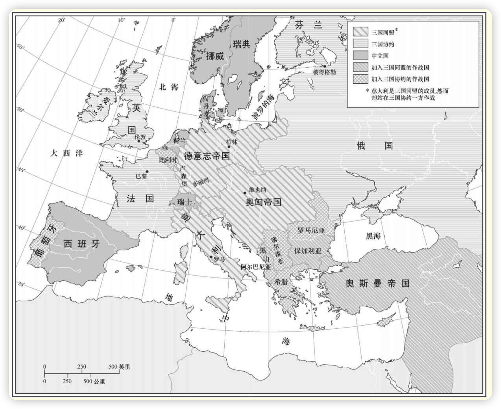
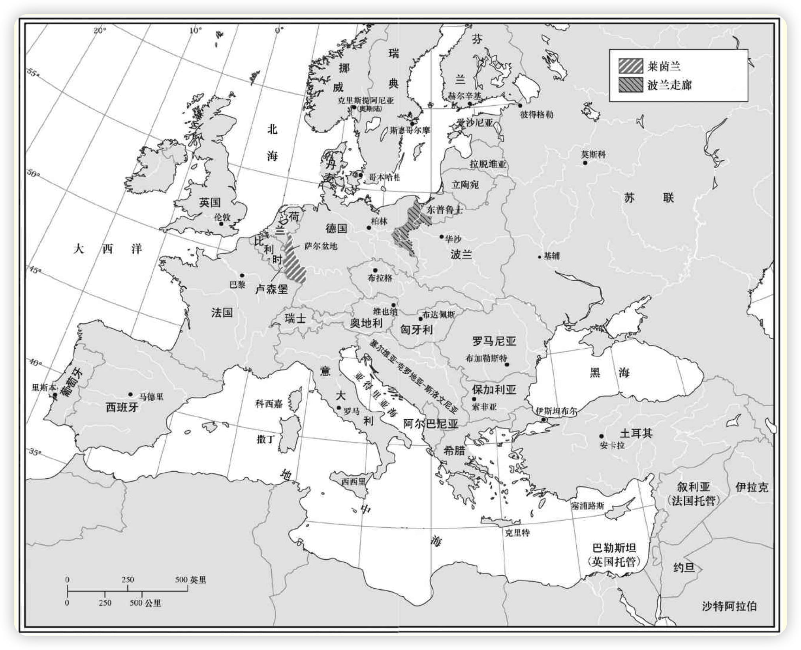

全球的一体化前所未有，导致了西方的技术、观念和制度正以加速度扩散。但是反过来，也正是这种扩散逐渐削弱了1914年之前似乎不可侵犯的西方全球霸权。诸殖民地民族正在有选择地采纳西方文明来对西方进行更有效的抵抗。因此，1914年以来的世界历史既是西方成功的历史，又是西方衰落的历史。
<!-- more -->

# 1. 第一次世界大战：全球性影响【1914-1918】

用亚洲人的观点来看，1914年至1918年的第一次世界大战是欧洲民族共同体内的一场内战。

1914年的欧洲

### 1.1 相互冲突的联盟体系

联盟体系始于1879年德国宰相奥托·冯·俾斯麦与奥匈帝国缔结两国同盟条约之时。这是一个防御性的盟约，旨在保护德国免受法国人的攻击，因为后者想收复1871年失去的阿尔萨斯——洛林地区。这个条约还旨在保护奥匈帝国免受俄国人的攻击。

1882年，两国同盟因意大利的加入而变成三国同盟。它的目的还是防御：保护意大利免受法国的攻击，因为意、法两国在突尼斯发生了尖锐的冲突。

1894年法俄同盟缔约成立，它的两个目的是反对三国同盟和抵制英国对殖民地的争夺。法俄同盟因1904年英法协约和1907年英俄协约的签订而成为三国协约。

### 1.2 萨拉热窝

1914年6月28日，奥匈帝国皇储弗朗茨·斐迪南和他的妻子在萨拉热窝。在这一天较晚些时候，皇储夫妇被塞尔维亚人培训和指使的青年革命分子刺杀，点燃了导致第一次世界大战的导火线。

7月23日，奥匈帝国向塞尔维亚发出最后通牒，包含若干苛刻的条件。塞尔维亚7月25日的答复几乎接受所有条件，但拒绝奥匈帝国官员在塞尔维亚领土上参与调查该案的要求。奥匈帝国立刻断绝同塞尔维亚的外交关系，并于7月28日向塞尔维亚宣战。

塞尔维亚的背后是俄国，而俄国的背后是法国和英国。同样，奥匈帝国也有德国支持，理论上还有意大利支持。因而，民族自决与相互冲突的联盟体系的结合使欧洲陷入大屠杀之中。

俄国为了报复，于7月30日命令全国总动员。第二天，德国向俄国发出为期12个小时的最后通牒，要求停止总动员。德国没有得到答复，于8月1日向俄国宣战，并于8月3日向俄国的同盟国法国宣战。

就在同一天，德国入侵比利时，开始了实际的战争行动。英国人在德国卷入后开始干预，但他们这么做，公开的借口并不是与法国的秘密军事承诺，而是对德国人入侵比利时的反应，这更宜为英国公众所接受。这样，欧洲列强在萨拉热窝刺杀事件过去5个星期时就已开始互相进攻。

### 1.3 战争的欧洲阶段：1914—1917年

##### 1.3.1 1914年：西线的消耗战

第一次世界大战开始时，双方诸民族都满怀信心地期待着一场短暂而又胜利的战争。但是，他们不久便发现自己卷入了一场持久而残酷的折磨之中，在这场战争中损失的财富和伤亡的人数是前所未有的。

前四个月中西线的伤亡人数为：德国70万人、法国85万人、英国9万人。与各总参谋部的计划相反，西线的战斗这时变成了阵地战和消耗战。

在俄国战线和巴尔干战线。俄国人一开始就以惊人的速度和强有力的攻势攻入东普鲁士。这一战略很奏效，导致德国人从比利时调集了四个师去支援东线。

在巴尔干战线上，奥地利人25万人渡过德里纳河，进入塞尔维亚。但是，他遭到了35万塞尔维亚军队的抵抗，他们当中90%的人是参加过1912年至1913年巴尔干战争的老兵。在不到两个星期中，这些塞尔维亚人就迫使奥地利人在损失三分之一兵力的情况下退回到德里纳河以西。

##### 1.3.2 1915年：东线上俄国的退却

1915年的一些战役为德军新任总司令埃里希·冯·法金汉所左右。鉴于西线上的僵持局面，把兵力集中到了东线，力图击败俄国人。俄国除军事上共伤亡250万人外，还丢失了15%的领土，损失了10%的铁路，失去了30%的工业，丧失了20%的平民人口。沙皇专制政权遭到了使它再也无法复原的打击。

西线的消耗战仍在继续。法国的霞飞将军坚信，密集的炮火轰炸加上大部队的正面攻击必将带来胜利。但是，接二连三的进攻并未使战线发生变化，结果只是人员伤亡惨重。

1914年11月2日，土耳其加入同盟国，第一次世界大战参加了著名的达达尼尔战役。保加利亚于1915年10月14日加入同盟国。这一介入意味着塞尔维亚人的末路。10月6日，德国、奥匈帝国和保加利亚军队以压倒优势的兵力从三面进攻塞尔维亚。到年底时，整个国家全被占领。

尽管意大利人表面上曾是同盟国的盟友，但战争一开始他们就决定保持中立。协约国这时慷慨地提出将这些领土以及战胜土耳其后的另外一些领土分给意大利。意大利决定加入协约国的阵营，使协约国的力量得到加强。

##### 1.3.4 1916年：凡尔登战役和索姆河战役

1916年2月，德国人发动了对法国要塞凡尔登的全面进攻。英国人则以对索姆河西北地区的攻势进行反击。但是，防守再次被证明比进攻更有优势。1916年的这两次战役使德国死伤约85万人，英法死伤约95万人。然而，任何一方向前的推进都未超过7英里。

与此同时，俄国军队在勃鲁西洛夫将军的领导下，在东线展开了一次成功的攻势。德国人在凡尔登战役中的失败和勃鲁西洛夫的进攻所获得的意外成功促使罗马尼亚于1916年8月27日站到了协约国一边参战。

同盟国这时决定教训一下罗马尼亚，以警告其他企图效仿罗马尼亚做法的中立国。德国、奥匈帝国、保加利亚和土耳其军队以压倒优势的兵力突然袭击了罗马尼亚。到这一年年底，罗马尼亚人已丢失了三分之二的国土，其中包括他们的首都。

1917年6月27日，希腊也站到了协约国一边参战，从而为1918年进攻马其顿、迫使保加利亚退出战争铺平了道路。

##### 1.3.5 1917年：流血和失败主义

1916年，德国人曾在凡尔登采取攻势，而现在，1917年，协约国却处于领先地位。

德国人已用领导东线部队的兴登堡和鲁登道夫取代了法金汉。法国、英国和加拿大军队按照预定计划跃出壕沟发动进攻，但却遭到了自大战以来最惨重的一次失败。兴登堡的防御战略对德国人非常有用。他们使协约国蒙受了40万人的伤亡，而己方只伤亡了25万人。

到这时，欧洲各民族已经进入了历史上最具毁灭性、最残酷的战争的第四个年头。人们尽管付出了种种牺牲，遭受了种种灾难，但还是看不到战争的尽头。

### 1.4 战争的全球阶段：1917年的俄国革命

1917年因两个重大的事态进展——俄国革命和美国参战——而被证明是决定性的一年。这些事件改变了战争的性质——最初主要为欧洲问题而开战，实质上是欧洲的事务，这时转变成全球范围的战争。

##### 1.4.1 **1917年的二月革命**

1917年，俄国爆发了两次革命：第一次在3月（俄历2月），结束了沙皇专制统治，成立了临时政府；第二次在11月（俄历10月），推翻了临时政府，确立了苏维埃政权。

##### 1.4.2 两次革命之间

1917年3月至11月是临时政府和人民党的革命团体即苏维埃之间为权力而斗争的时期。

4月16日，列宁回到彼得格勒并发表了他那著名的“四月提纲”，提出了立即实现和平、将土地分给农民和全部政权归苏维埃的要求。到1917年年底时，许多人都在准备为“一切权力归苏维埃”而战斗，以摆脱临时政府，因为临时政府阻碍了人们获得极为向往的和平和土地。

##### 1.4.3 **1917年的布尔什维克革命**

李沃夫和克伦斯基组成了新临时政府。新临时政府一直执政到7月20日。从7月20日起，一直以有影响的掌权者形象出现的克伦斯基组成了一个以他自己为总理的新政府。

到10月时，他们已在彼得格勒和莫斯科的苏维埃中占据多数。列宁这时断定，推翻克伦斯基、实现社会主义革命的时机已经来临。起义日期被定在11月7日。

新的布尔什维克政府采取的首批措施中的一个就是履行和平的诺言。1918年3月3日，它同德国签署了《布列斯特-立陶夫斯克和约》，该和约严厉的条款要求俄国交出波兰、波罗的海沿岸诸省、芬兰、乌克兰和高加索部分地区。交出的地区包括6200万人口和125万平方英里的领土；更具灾难性的是，这些地区蕴藏着俄国四分之三的铁和煤。它们还包括俄国一半的工厂和三分之一的产粮区。

俄国便退出了第一次世界大战，新的布尔什维克统治者着手创立苏维埃社会主义共和国联盟。

### 1.5 战争的全球阶段：美国的介入

第一次世界大战开始时，威尔逊总统立刻号召他的同胞严守中立。到了1917年时，威尔逊本人却正在将这个国家引向战争。

赞成介入战争的还有美国的金融家和工业家，他们一直在用赊销的方式向英国和法国提供军用物资，如果他们的顾客战败了，他们也将破产。德国无限制的潜艇战导致美国人员和船只的损失也加速了美国的参战。

在1918年3月，共计84889名美军到达西线，6月，这个数字上升到306350人。这样，协约国的指挥官每月都可得到一支新的生力军。不出所料，1918年同盟国一个接一个地投降了。

这样，第一次世界大战便宣告结束——这场战争历时4年零3个月多，涉及30个主权国家，推翻了4个帝国，产生了7个新的国家，死亡人数为：战斗人员约850万，非战斗人员约1000万，直接经济损失达1805亿美元，间接经济损失达1516亿美元。

### 1.6 和平解决

欧洲地图被大幅度修改。为了让土耳其退出战争，协约国支持阿拉伯人摆脱土耳其获得独立的努力。阿尔萨斯——洛林地区毫无疑问归还给了法国。俄国由于芬兰、拉脱维亚、爱沙尼亚和立陶宛等独立国家的建立而失去了它在波罗的海沿岸的大部分地区。

独立的波兰在前俄国、德国和哈布斯堡帝国割让的诸省领土上成立；捷克斯洛伐克出现在前哈布斯堡帝国的版图上。南斯拉夫也形成了，它由战前的塞尔维亚、黑山和南斯拉夫人居住的各色前哈布斯堡帝国疆域组成。

罗马尼亚因从奥匈帝国、俄国和保加利亚获得领土而使其面积增加了一倍多。最后，在古老的哈布斯堡帝国剩余的地区则出现了奥地利和匈牙利这两个小国家。

第一次世界大战后的欧洲（1923年）

### 1.7 世界历史上的第一次世界大战

欧洲的边界四大帝国的消失【奥匈帝国，奥斯曼帝国，德意志帝国，俄罗斯帝国】。

战争不但在经济上，而且在政治上使欧洲内部遭到摧残。1914年以前，欧洲已是近代基本的政治思想和政治制度的发源地。正如我们所看到的那样，这些思想和制度的影响已波及全球各个角落。然而，战争的浩劫却使欧洲人士气沮丧，失去信心。在欧洲大陆的各个地方，古老的秩序正在受到怀疑和挑战。

欧洲的霸权也被第一次世界大战削弱，因为这次大战对海外殖民地产生了影响。欧洲列强的一个集团同另一集团血战到底的惨状不可弥补地损坏了白种主人的威信。

# 2. 殖民地世界的民族主义起义

第一次世界大战之后，殖民地地区出现了革命的浪潮。

### 2.1 土耳其

第一次世界大战后，在所有反对欧洲人统治的殖民地起义中，土耳其人的起义最为恢宏、最为成功。大战期间，他们遭到了惨败，接着，被迫接受了屈辱的停战协定与和平条约。

然而，他们很快便挽回了败局，在武装冲突中击败了他们的敌人，赢得了一个新条约，有着较为有利的条款。因此，在所有的同盟国中，只有落后且被轻视的土耳其有能力反抗获胜的协约国，迫使它们接受对媾和条约所作的修改。

1914年11月，当土耳其加入同盟国后，英国人便同阿拉伯领导人麦加王子埃米尔·侯赛因协商军事联盟。作为对阿拉伯人反抗土耳其人的回报，英国人同意承认战后各阿拉伯国家的独立。

土耳其成功的一个主要原因是后来被称为“土耳其之父”的穆斯塔法·凯末尔的人格。他因在反对协约国的战争中成功地保卫了达达尼尔海峡而成名。凯末尔在变革的巨大洪流中进行了一个又一个的改革。

首都从易受攻击的君士坦丁堡（今伊斯坦布尔）迁移到小亚细亚中心地带的安卡拉；废除了哈里发制；取缔所有的宗教社团和寺院；与新的民法典、刑法典和商法典一起采用一部宪法；给予妇女以选举权，并允许她们参加议会。至1938年11月10日凯末尔去世时，新土耳其已经确立。

### 2.2 阿拉伯中东

英国人同意承认战后各阿拉伯国家的独立。但这一承诺与英国人对世界犹太复国主义组织的罗斯柴尔德勋爵所作的许诺相冲突。1917年11月2日，贝尔福勋爵写信给罗斯柴尔德勋爵，宣称英国政府赞成在巴勒斯坦建立一个“犹太人的家园，，这一《贝尔福宣言》和协约国之间瓜分奥斯曼帝国的秘密条约都是相冲突的。

在巴勒斯坦本土，随着犹太移民的不断涌入及忧虑重重的阿拉伯人对犹太人和英国人的回击，这种三方间的冲突变得日趋激烈。英国人预料，犹太人的迁移永远不会达到侵犯阿拉伯人“权利和地位”的程度。

阿拉伯人对犹太人的攻击变得愈益频繁和猛烈。英国的反应是在这些大暴动之后派出了皇家专门调查委员会。到第二次世界大战时，几个委员会已对情况进行了调查，他们企图满足三方不同且相互冲突的利益——犹太复国主义者的热望、阿拉伯人的民族主义要求和英帝国的利益，所以他们的建议始终摇摆不定。

### 2.3 印度

1914年，印度齐心协力地支持英国参战。王公们提供了大量的财政援助，同时，至少有90万印度人在英国军队中当战斗员，另外，还有30万印度人当劳工。然而，第一次世界大战结束才过了29年，英国对印度的统治便告结束。

甘地无疑是战后这场反英运动中最杰出的人物，他是现代印度之父。印度民族主义者发生了分裂，印度的许多穆斯林认为，同他们的印度教邻居相比，伊斯兰世界其他地区的人与他们的共同之处更多。

### 2.4 中国

在中国，孙中山于1911年建立了共和国，组织了他的政党国民党。1925年孙中山去世后，蒋介石成为国民党和中国的领袖。在他的领导下，在修建铁路、公路，建立工业，改进公共卫生和教育等方面取得了重大进展。

1921年7月，中国共产党在上海成立。共产党因其“打土豪，分田地”的政策争取了广大农民而幸存下来。在与蒋介石的“围剿”进行了数年斗争之后，毛最终冲出包围，到达西北诸省，在那里艰苦奋斗，建立了根据地。

由于他的土地改革政策和日本人在东部沿海的进攻削弱了蒋的政府，他渐渐地扩大了他的根据地。日本人的侵略和共产党的强大加在一起最终迫使蒋介石于1949年逃往台湾地区，毛泽东成为中国大陆的领导者。

# 3. 1929年以前欧洲的革命与和解

在整个欧洲大陆，旧秩序正受到怀疑，部分是因为世界大战所带来的创伤，部分是因为俄国革命的影响。

### 3.1 共产主义在俄国的胜利

1921年，内战和外国的侵略一直都还在一起蹂躏俄国。但令人意外的是，最后红军却出于各种原因取得了胜利。也许最重要的原因是，布尔什维克【苏联共产党】在争取农民群众的支持方面通常做得更成功。

回想起来，长期的内战和干涉对相关的所有党派都是一场灾难。它使从波罗的海到太平洋的俄国农村荒废，使俄国人民大批死于横祸、饥饿和疾病。同样严重的是新成立的苏联与西方世界之间的关系也在恶化。

苏维埃领导人加深了“资本主义包围”这种马克思主义式的担忧，而西方政治家则对1919年建立的共产国际的无用宣言过于认真。这种相互的不信任既深刻又持久，从而毒化了随后10年的国际关系，大大促成了第二次世界大战的到来。

### 3.2 共产主义在中欧的失败

1914年时的德国社会民主党是欧洲最强大的政党，但它很保守，专心致力于社会改革而不是革命。同样重要的是德国农民的富庶，因此，布尔什维克的“把土地分给农民”的口号虽然在俄国非常有效，但对德国的影响却很小。

德国在1919年1月19日进行了国民议会而非苏维埃代表大会的选举。这样，在德国出现的新国家就是民主的魏玛共和国，而不是一个苏维埃德国。

同样的格局也在奥地利和希腊占上风，出于种种原因，农民政党从未在这两个国家生根。奥地利最后于1934年建立了由陶尔斐斯总理领导的独裁政府，希腊于1936年建立了由迈塔克萨斯将军领导的公然的法西斯政权。这样，到第二次世界大战时，整个中东欧就全处于独裁统治之下，只有一个国家例外，这就是捷克斯洛伐克。

### 3.3 意大利成为法西斯国家

墨索里尼1919年，他建立起第一个“战斗队”，并组织了法西斯党。1922年秋，墨索里尼以尊重君主政体和教会利益的明确保证赢得了国王和教会的支持，从而为一场政变做好了准备。

墨索里尼统治下的意大利的另一个特点是精心设计的市政工程规划，这是为了提供就业机会，竖立令人印象深刻的建筑物，以颂扬法西斯主义。

### 3.4 西欧的民主主义问题

民主制度在西方有着更深的根基，因此，主要的社会结构更健全，并享有更多的民意支持。不过，绝不能因此就认为西欧在战后数年中没有遇到困难。实际上，它也有许多问题，其中最严重的就本质来说是经济问题，尽管它也带来了深远的社会和政治后果。西欧两个主要国家英国和法国的经历可以很好地说明这一点。

### 3.5 欧洲的稳定与和解

在大战刚结束的几年中，欧洲的外交为法国及其中欧和东欧的盟国所支配。由于奥匈帝国的消失、德国和俄国的衰竭，法国这时成为欧洲大陆上的头号强国。

大约在1925年前后，法、德两国的关系有了改善，德国可以加入国际联盟，并成为常任理事会成员。作为回报，德国同意不通过武力来谋求条约的修订，和平解决同法国、比利时、捷克斯洛伐克和波兰的一切争端。

20世纪20年代末期人们普遍有一种感觉，认为欧洲终于恢复到了正常状态：德国和它以前的敌人似乎已经和解；德国加入了国联；赔款问题似乎终于得到了解决；60多个国家已摈弃将战争作为“推行国策的一种工具”；繁荣程度在增长，失业率正相应下降。

# 4. 五年计划和大萧条

### 4.1 五年计划

布尔什维克一旦居于俄国主人的地位，就面临着挑战，要建立起新的社会主义社会，如他们久已宣传的那样。他们很快便发现，他们对迎接这一挑战毫无准备——过去的历史中没有任何模式可循。

注重实际的列宁认识到让步是不可避免的，因而于1921年采取了“新经济政策”（NEP），这一政策允许局部地恢复资本主义。在1924年逝世前不久，列宁似乎已经认定继续实行新经济政策是为社会主义指出的最佳之路。

斯大林清楚地看到，共产党是这个国家唯一的实权力量，他利用党的总书记身份使自己成为党和国家的主人。在经过相当大的动摇之后，斯大林决定放弃新经济政策，支持工业和农业都由莫斯科控制和管理的中央集权经济。

1928年，斯大林开始实行由国家计划委员会制订的一系列五年计划中的第一个。苏联农场用比美国农场多出50%的土地耕种，用10倍的人力劳作，但其产量却只有后者的四分之三。

到1932年第一个五年计划结束时，苏联的工业产量已从世界第五位上升到第二位。这一非凡的激增不仅是因为苏联生产率的提高，而且还由于大萧条所造成的西方生产率的下降。

对苏联人民来说，五年计划是一件祸福兼有的事情。从积极的一面来看，它们使国家在经济和军事上强大起来，从而大大有助于在第二次世界大战中打败希特勒。五年计划还把国家从一个落后的社会变成一个现代社会。

### 4.2 大萧条

20世纪20年代，因不少国家支付战争债务，金钱源源不断地流入美国；美国的黄金贮藏量在1913年至1924年间从19.24亿美元增加到44.99亿美元，占世界黄金总贮藏量的一半。

1925年至1928年间，美国平均每年的对外投资总额达到11亿美元。当然，这种情况最终加强了不平衡，不可能无限持续下去。由于支付款到期，债务国不得不削减从美国的进口，美国某些经济部门，尤其是农业，也就受到了损害。此外，有些国家不得不拖欠债务，这就动摇了美国的某些金融公司。

美国股票市场的崩溃始于1929年9月。一个月内，股票的价值下降了40%，而且，除了少数几次短暂回升外，下跌持续了三年。在此期间，美国钢铁公司的股票从262下降到22，通用汽车公司的股票从73下降到8。到1933年，工业总产量和国民收入暴跌了将近一半，商品批发价格下跌了近三分之一，商品贸易下降了三分之二以上。

这些经济大灾难引发了同样严重的社会问题。其中最严重的是大规模的失业，已达到了悲惨的程度。1933年3月，美国的失业人数据保守的估计为1400多万，相当于全部劳动力的四分之一。在英国，失业人数将近300万，在全部劳动力中所占的比例与美国大致相同。德国的情况最糟，工会成员中有五分之二以上的人失业，另外还有五分之一的人只有非专职工作。

阿道夫·希特勒35岁，在狱中写下了《我的奋斗》。大萧条为他赢得了狂热的听众，拥戴他为元首。1933年1月30日，希特勒成为内阁总理，开始像墨索里尼一样用宣传和恐怖统治德国。

# 5. 走向战争，1929—1939年

由于英国、法国及其欧洲大陆盟国坚持维护现状，德国、意大利和日本努力要求改变现状，因五年计划而变得强大的苏联在国际事务中起着日益重要的作用，出现了一种三足鼎立的局面。这三方力量的相互影响，解释了20世纪30年代一再发生的危机和第二次世界大战最终爆发的原因。

### 5.1 日本入侵中国东北

1931年9月18日晚，在沈阳北部，一场爆炸破坏了日控南满铁路的一小段。日本关东军未经宣战就在24小时内攻占了沈阳和长春，然后成扇形向四面八方展开。1932年1月下旬对哈尔滨的占领终结了东北各种有组织的抵抗。1932年3月，胜利者将他们的占领地重新命名为“满洲国”。

### 5.2 意大利征服埃塞俄比亚

数年来，法国一直都在通过与捷克斯洛伐克、波兰、南斯拉夫等邻国组成的联盟网络支撑着欧洲的现状。但是，当希特勒成为德国总理，要求修改《凡尔赛和约》条款，并与墨索里尼一起开始摧毁整个凡尔赛体系时，这种祥和的形势被急剧改变。

1935年3月16日，希特勒背弃了《凡尔赛和约》中关于解除德国武装的条款，同时开始实施大规模重整军备的计划。西方国家的反应是呼吁采取共同行动来反对德国的威胁，但是它们光说不动，于是，德国再次成为一个军事强国。这从根本上改变了欧洲的均势，因为德国的军队和防御工事现在已把法国和它的中欧、东欧盟友分隔开来。

1935年10月3日，墨索里尼的军团侵入独立的非洲王国埃塞俄比亚。侵略的背后有几个动机，其中包括墨索里尼的热切期望：一是恢复罗马帝国的荣光；二是通过殖民地扩张来缓解国内经济困境。国联作出反应，宣布意大利为侵略者，投票赞成对意实行经济制裁。

意大利人于1936年5月5日耀武扬威地进入亚的斯亚贝巴。同一天，墨索里尼宣布“罗马和平，它体现在‘埃塞俄比亚是意大利的’这一简单、不可改变、明确的短语中”。于是，在牺牲了3000人并损失了10亿美元之后，墨索里尼赢得了一个拥有35万平方英里土地、1000万人口和丰厚自然资源的帝国。

### 5.3 西班牙内战

20世纪的西班牙截然不同于16世纪，那时，它是欧洲最强大、最令人畏惧的国家。在这几个世纪中，西班牙衰落的象征是1898年的美西战争，西班牙残余的大多数殖民地被美国轻易夺走，颜面尽失。

1931年4月14日，西班牙宣布成立共和国，随后举行了立宪会议选举。这一实体于7月成立，成员分为三大派：保守主义的右派、共和主义的中间派，以及由社会党人、斯大林主义的共产党人、托洛茨基派的共产党人和无政府工团主义者组成的左派。

//TODO:

# 6. 第二次世界大战：全球性后果【1931-1945】

# 7. 诸帝国的终止

# 8. 大同盟、冷战及后果

# 9. 第二次工业革命：全球性影响

