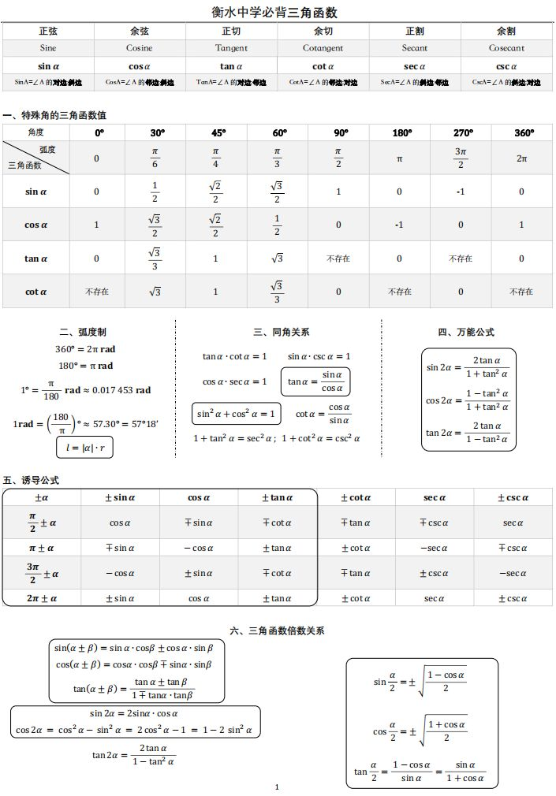

唯有记忆，才能滚瓜烂熟。

<!-- more -->

# 1. 三角函数

### 1.1 常见角度

### 1.2 图

# 2. 导数

# 10. 参考资料

+ https://zhuanlan.zhihu.com/p/429677197
+ https://zhuanlan.zhihu.com/p/390928056
+ https://zhuanlan.zhihu.com/p/150179384
+ https://www.zhihu.com/question/20829733/answer/715746456

